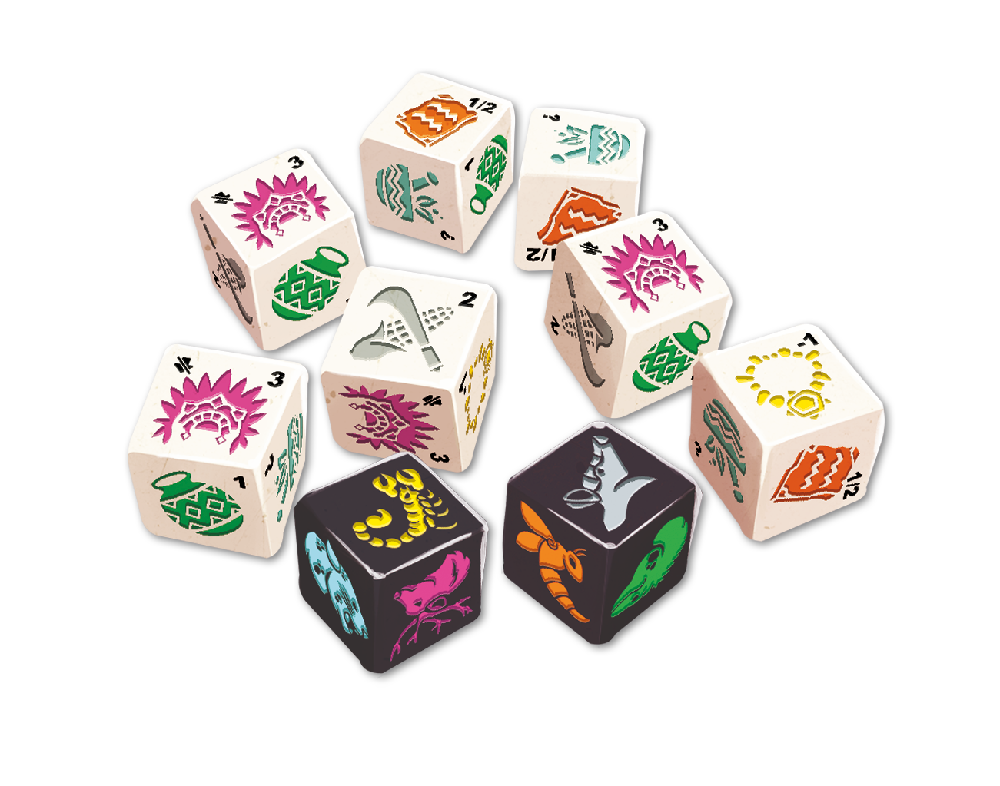
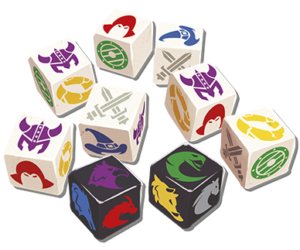

Find all the solutions for me please!
=====================================

I decided to code a program that searches for all the solutions to these two puzzles (google for "oldchap.games"):
- "Coba", written by Antonin Boccara and Michel Verdu, published by Oldchap
- "By Odin", written by Antonin Boccara and Michel Verdu, published by Oldchap

I first used the help of ChatGPT, but of course, as in all cases where one must do something advanced, it served only as an assistant, and I had to finish all the parts of the code that were truly complicated.

"I have completed the full implementation, and now my computer is running to search for all possibilities with 7 white dice from the first puzzle and 7 white dice from the second puzzle.

I will add all the solutions that have been found as comments in the code. Next, there's something more complex, which is to add all the black dice and all combinations of all the black dice. For now, I will stop here, and if someone wants to pick up the code and finish with all the combinations of all the black dice, it would be great to evolve the project and also have all the combinations with all the black dice.

Coba
====


The time has come for you to undertake the quest for the stones of Coba... Will you be up to the challenge?

In 'The Stones of Coba,' you will need to solve 50 logical challenges to restore balance within the Mayan society. In this solo, narrative, and evolving game, you will discover the game's rich mechanics through various challenges.

A very small box for hours of gameplay!

By Odin
=======


The legend tells that one day a human will come to the realm of Asgard and play alongside the gods… Will you be that hero?

In 'Par Odin', you take on the role of a human warrior who has come to accomplish 50 challenges in order to sit at the table of the gods. In this single-player, narrative, and evolving game, you will gradually, through the challenges, discover the mechanical richness of the game and the universe of Norse mythology.

A very small box for hours of gameplay!

## Solutions Found 
- Hero → ⚔️
- Captain → 🎖️
- Peasant → 👨‍🌾
- Queen → 👸
- Soldier → 🪖
- Potter → ⚱️
- Scribe → ✍️
- Mage → 🧙
- Shaman → 🪬
- Traitor → 🗡️
- Thief → 💰
- Cursed → ☠️

```
[🎖️/0, 👨‍🌾/0, ⚔️/3, ⚔️/3, ⚔️/3, ⚔️/3, 👸/3] = 15 - [⚔️/3, 🪖/1, ⚱️/1, ⚱️/1, ⚱️/1, ⚱️/1, 🪬/7] = 15
[🎖️/0, 👨‍🌾/0, 👸/3, 👸/3, 👸/3, 👸/3, 👸/3] = 15 - [⚔️/3, ⚔️/3, ⚔️/3, ⚔️/3, 🪖/1, 🪖/1, ⚱️/1] = 15
[🎖️/2, 🧙/4, ⚔️/3, ⚔️/3, ⚔️/3] = 15 - [⚔️/3, 🪖/0, ✍️/0, ✍️/0, ✍️/0, 👸/3, 👸/3, 👸/3, 👸/3] = 15
[🎖️/2, 🪬/9, ⚔️/3, ⚔️/3, 🪬/9] = 26 - [⚔️/3, ⚔️/3, ⚔️/3, 🪖/0, 🪬/5, 👸/3, 👸/3, 👸/3, 👸/3] = 26
[🎖️/2, 🪖/0, ⚔️/3, ⚔️/3, ⚔️/3, ⚔️/3, 👨‍🌾/2, 👨‍🌾/2, 👨‍🌾/2, 👸/3] = 23 - [⚔️/0, 🪬/10, 🪬/10, 👸/3] = 23
[🎖️/2, 🪖/1, 🎖️/2, 🎖️/2, 🎖️/2, 🪬/6, 🪬/6, 🪬/6] = 27 - [⚔️/0, ⚔️/0, 🪬/8, 🪬/8, 🪬/8, 👸/3] = 27
[🎖️/2, 🪖/1, 🎖️/2, 🎖️/2, 👨‍🌾/2, 👨‍🌾/2, ✍️/2, ✍️/2] = 15 - [⚔️/3, ⚔️/3, 🪖/0, 👸/3, 👸/3, 👸/3] = 15
[🎖️/2, 🪖/1, 🎖️/2, 🎖️/2, 🪖/1, ⚱️/1, ⚱️/1, ⚱️/1, ⚱️/1, ⚱️/1] = 13 - [⚔️/0, ⚔️/0, 🪬/10, 👸/3] = 13
[🎖️/2, 🪖/1, ⚔️/3, 🎖️/2, 🎖️/2, 🎖️/2, ⚱️/1, 👨‍🌾/2] = 15 - [⚔️/0, 👸/3, 👸/3, 👸/3, 👸/3, 👸/3] = 15
[🎖️/2, 🪖/1, ⚔️/3, 🎖️/2, 🎖️/2, 🪖/1, 👨‍🌾/2, 👨‍🌾/2] = 15 - [⚔️/0, 👸/3, 👸/3, 👸/3, 👸/3, 👸/3] = 15
[🎖️/2, 🪖/1, ⚔️/3, ⚔️/3, 🎖️/2, 🧙/6, ✍️/1] = 18 - [⚔️/0, 👸/3, 👸/3, 👸/3, 👸/3, 👸/3, 👸/3] = 18
[🎖️/2, 🪖/1, ⚔️/3, ⚔️/3, ⚔️/3, 🎖️/2, 🎖️/2, 👨‍🌾/2] = 18 - [👸/3, 👸/3, 👸/3, 👸/3, 👸/3, 👸/3] = 18
[🎖️/2, 🪖/1, ⚔️/3, ⚔️/3, ⚔️/3, ⚔️/3, 🪖/1, ✍️/2] = 18 - [👸/3, 👸/3, 👸/3, 👸/3, 👸/3, 👸/3] = 18
[🎖️/2, 🪖/1, 🗡️/1, ⚱️/1, 👨‍🌾/2] = 7 - [⚔️/3, ⚔️/3, ⚔️/3, ⚔️/3, 💰/-1, 💰/-1, 💰/-1, 💰/-1, 💰/-1] = 7
[🎖️/2, 💰/0, 👸/3, 👸/3, 👸/3, 👸/3, 👸/3] = 17 - [⚔️/3, ⚔️/3, ⚔️/3, ⚔️/3, ⚔️/3, 🪖/1, ✍️/1] = 17
[☠️/-1, 🎖️/2, 🧙/8, 💰/-1, 💰/-1, 💰/-1, 💰/-1, 💰/-1, 💰/-1] = 3 - [⚔️/0, ⚔️/0, ⚔️/0, ⚔️/0, 👸/3] = 3
[☠️/-1, ☠️/-1, ☠️/-1, 🪬/8, 🪬/8, 🪬/8] = 21 - [⚔️/0, ⚔️/0, ⚔️/0, ⚔️/0, 🪬/6, 🪬/6, 🪬/6, 👸/3] = 21
[☠️/-1, ☠️/-1, ⚔️/3, ⚔️/3, ⚔️/3, ⚔️/3, ⚔️/3, 💰/-1] = 12 - [✍️/0, ✍️/0, 👸/3, 👸/3, 👸/3, 👸/3] = 12
[☠️/-1, ☠️/-1, ⚔️/3, ⚔️/3, ⚔️/3, ⚔️/3, ✍️/2, 💰/-1] = 11 - [🗡️/1, ✍️/2, ✍️/2, ✍️/2, ✍️/2, ✍️/2] = 11
[☠️/-1, ☠️/-1, ⚔️/3, ⚔️/3, ⚔️/3, ⚔️/3, 🪬/3, 🪬/3, 🪬/3, 🪬/3, 🪬/3] = 25 - [⚔️/3, 🪬/11, 🪬/11] = 25
[☠️/-1, ☠️/-1, ⚔️/3, ⚔️/3, ⚔️/3, ⚔️/3, 💰/-1, 💰/-1, 💰/-1, 💰/-1, 💰/-1] = 5 - [🧙/2, ⚱️/0, 👸/3] = 5
[☠️/-1, ☠️/-1, ⚔️/3, ⚔️/3, ⚔️/3, ⚔️/3, 💰/-1, 💰/-1, 💰/-1, 💰/-1, 💰/-1] = 5 - [🧙/2, ✍️/0, 👸/3] = 5
[☠️/-1, ☠️/-1, ⚔️/3, ⚔️/3, ⚔️/3, ⚔️/3, 💰/-1, 💰/-1, 💰/-1, 💰/-1, 💰/-1] = 5 - [🗡️/1, 👨‍🌾/2, 👨‍🌾/2] = 5
[☠️/-1, ☠️/-1, ⚔️/3, ⚔️/3, ⚔️/3, ⚔️/3, 💰/-1, 💰/-1, 💰/-1, 💰/-1] = 6 - [🗡️/1, ⚱️/1, 👨‍🌾/2, 👨‍🌾/2] = 6
[☠️/-1, ☠️/-1, ⚔️/3, ⚔️/3, ⚔️/3, ⚔️/3, 💰/-1, 💰/-1, 💰/-1, 💰/-1] = 6 - [🗡️/1, ⚱️/1, ✍️/2, ✍️/2] = 6
[☠️/-1, ☠️/-1, ⚔️/3, ⚔️/3, ⚔️/3, ⚔️/3, 💰/-1, 💰/-1, 💰/-1] = 7 - [🗡️/1, ⚱️/1, ⚱️/1, 👨‍🌾/2, 👨‍🌾/2] = 7
[☠️/-1, ☠️/-1, ⚔️/3, ⚔️/3, ⚔️/3, ⚔️/3, 💰/-1, 💰/-1] = 8 - [🗡️/1, ⚱️/1, ⚱️/1, ⚱️/1, 👨‍🌾/2, 👨‍🌾/2] = 8
[☠️/-1, ☠️/-1, ⚔️/3, ⚔️/3, ⚔️/3, ⚔️/3, 💰/-1, 💰/-1] = 8 - [🗡️/1, ⚱️/1, ⚱️/1, ⚱️/1, ✍️/2, ✍️/2] = 8
[☠️/-1, ☠️/-1, ⚔️/3, ⚔️/3, ⚔️/3, ⚔️/3, 💰/-1] = 9 - [🗡️/1, ⚱️/1, ⚱️/1, ⚱️/1, ⚱️/1, 👨‍🌾/2, 👨‍🌾/2] = 9
[☠️/-1, ☠️/-1, ⚔️/3, ⚔️/3, ⚔️/3, ⚔️/3] = 10 - [🗡️/1, ⚱️/1, ⚱️/1, ⚱️/1, ⚱️/1, ⚱️/1, 👨‍🌾/2, 👨‍🌾/2] = 10
[☠️/-1, ☠️/-1, ⚔️/3, ⚔️/3, ⚔️/3, ⚔️/3] = 10 - [🗡️/1, ⚱️/1, ⚱️/1, ⚱️/1, ⚱️/1, ⚱️/1, ✍️/2, ✍️/2] = 10
[☠️/-1, ☠️/-1, ⚔️/3, ⚔️/3, ⚔️/3, ✍️/2] = 9 - [🪖/1, 🗡️/1, ⚱️/1, ⚱️/1, ⚱️/1, ⚱️/1, ⚱️/1, ✍️/2] = 9
[☠️/-1, ☠️/-1, ⚔️/3, ⚔️/3, 🪬/6, 🪬/6, 🪬/6, 🪬/6] = 28 - [⚔️/0, ⚔️/3, 🗡️/1, 🪬/8, 🪬/8, 🪬/8] = 28
[☠️/-1, ☠️/-1, ⚔️/3, 🪬/7, 🪬/7, 🪬/7, 🪬/7] = 29 - [⚔️/3, ⚔️/3, ⚔️/3, ☠️/-1, 🪬/7, 🪬/7, 🪬/7] = 29
[☠️/-1, ☠️/-1, 🧙/8, 👨‍🌾/2, 💰/-1, 💰/-1, 💰/-1, 💰/-1, 💰/-1] = 3 - [⚔️/0, ⚔️/0, ⚔️/0, ⚔️/0, 👸/3] = 3
[☠️/-1, ☠️/-1, 🗡️/1, 💰/-1, 🪬/6, 🪬/6, 🪬/6, 🪬/6] = 22 - [⚔️/3, ⚔️/3, ⚔️/3, ⚔️/3, ✍️/2, 🪬/8] = 22
[☠️/-1, ⚔️/0, ⚔️/3, ⚔️/3, ⚔️/3, 🗡️/1, 🪬/4, 🪬/4, 🪬/4, 🪬/4] = 25 - [🧙/3, 👨‍🌾/2, 🪬/10, 🪬/10] = 25
[☠️/-1, ⚔️/0, ⚔️/3, ⚔️/3, ⚔️/3, 🗡️/1, 🪬/5, 🪬/5, 🪬/5] = 24 - [🎖️/2, 👨‍🌾/2, 👨‍🌾/2, 🪬/9, 🪬/9] = 24
[☠️/-1, ⚔️/3, ⚔️/3, 🎖️/2, 🎖️/2] = 9 - [⚔️/3, ⚔️/3, ✍️/0, ✍️/0, ✍️/0, ✍️/0, ✍️/0, ✍️/0, 👸/3] = 9
[☠️/-1, ⚔️/3, ⚔️/3, ⚔️/3, 🎖️/2] = 10 - [🎖️/2, 🗡️/1, ⚱️/1, ✍️/1, ✍️/1, ✍️/1, ✍️/1, ✍️/1, ✍️/1] = 10
[☠️/-1, ⚔️/3, ⚔️/3, ⚔️/3, ⚔️/3, 🎖️/2, ✍️/1] = 14 - [🎖️/2, ✍️/0, ✍️/0, 👸/3, 👸/3, 👸/3, 👸/3] = 14
[☠️/-1, ⚔️/3, ⚔️/3, ⚔️/3, ⚔️/3, ⚔️/3, 🎖️/2, 👨‍🌾/2] = 18 - [👸/3, 👸/3, 👸/3, 👸/3, 👸/3, 👸/3] = 18
[☠️/-1, ⚔️/3, ⚔️/3, ⚔️/3, ⚔️/3, ⚔️/3, ✍️/1, ✍️/1, 💰/-1, 💰/-1, 💰/-1] = 13 - [🗡️/1, ✍️/1, 🪬/11] = 13
[☠️/-1, ⚔️/3, ⚔️/3, ⚔️/3, ⚔️/3, ⚔️/3, ✍️/1, ✍️/1, 💰/-1] = 15 - [🗡️/1, 👨‍🌾/2, 👨‍🌾/2, ✍️/1, 🪬/9] = 15
[☠️/-1, ⚔️/3, ⚔️/3, ⚔️/3, ⚔️/3, ⚔️/3, ✍️/2, 💰/-1, 🪬/4, 🪬/4] = 23 - [🗡️/1, ✍️/2, 🪬/10, 🪬/10] = 23
[☠️/-1, ⚔️/3, ⚔️/3, ⚔️/3, ⚔️/3, ⚔️/3, 💰/-1, 💰/-1] = 12 - [⚔️/3, ✍️/0, ✍️/0, 👸/3, 👸/3, 👸/3] = 12
[☠️/-1, ⚔️/3, ⚔️/3, ⚔️/3, ⚔️/3, ⚔️/3, 💰/-1] = 13 - [🗡️/1, 👨‍🌾/2, 👨‍🌾/2, 👨‍🌾/2, 👨‍🌾/2, 👨‍🌾/2, 👨‍🌾/2] = 13
[☠️/-1, ⚔️/3, ⚔️/3, ⚔️/3, ⚔️/3, ⚔️/3, 💰/-1] = 13 - [🗡️/1, ✍️/1, ✍️/1, ✍️/1, ✍️/1, ✍️/1, 🪬/7] = 13
[☠️/-1, ⚔️/3, ⚔️/3, ⚔️/3, ⚔️/3, ⚔️/3] = 14 - [🗡️/1, ⚱️/1, 👨‍🌾/2, 👨‍🌾/2, 👨‍🌾/2, 👨‍🌾/2, 👨‍🌾/2, 👨‍🌾/2] = 14
[☠️/-1, ⚔️/3, ⚔️/3, ⚔️/3, ⚔️/3, ⚔️/3] = 14 - [🗡️/1, ⚱️/1, 👨‍🌾/2, 👨‍🌾/2, 👨‍🌾/2, 👨‍🌾/2, ✍️/2, ✍️/2] = 14
[☠️/-1, ⚔️/3, ⚔️/3, ⚔️/3, ⚔️/3, ⚔️/3] = 14 - [🗡️/1, ⚱️/1, 👨‍🌾/2, 👨‍🌾/2, ✍️/2, ✍️/2, ✍️/2, ✍️/2] = 14
[☠️/-1, ⚔️/3, ⚔️/3, ⚔️/3, ⚔️/3, ⚔️/3] = 14 - [🗡️/1, ⚱️/1, ⚱️/1, ⚱️/1, ⚱️/1, ⚱️/1, ✍️/2, 🪬/6] = 14
[☠️/-1, ⚔️/3, ⚔️/3, ⚔️/3, ⚔️/3, ⚔️/3] = 14 - [🗡️/1, ⚱️/1, ✍️/2, ✍️/2, ✍️/2, ✍️/2, ✍️/2, ✍️/2] = 14
[☠️/-1, ⚔️/3, ⚔️/3, ⚔️/3, ⚔️/3, 👨‍🌾/2, 👨‍🌾/2] = 15 - [⚔️/0, ⚔️/0, 👸/3, 👸/3, 👸/3, 👸/3, 👸/3] = 15
[☠️/-1, ⚔️/3, ⚔️/3, ⚔️/3, ⚔️/3, 👨‍🌾/2, 👨‍🌾/2] = 15 - [⚔️/3, ⚔️/3, 👨‍🌾/0, 👨‍🌾/0, 👸/3, 👸/3, 👸/3] = 15
[☠️/-1, ⚔️/3, ⚔️/3, ⚔️/3, ⚔️/3, 🪬/5, 🪬/5, 🪬/5, 🪬/5] = 31 - [⚔️/3, 🪖/1, 🪬/9, 🪬/9, 🪬/9] = 31
[☠️/-1, ⚔️/3, ⚔️/3, ⚔️/3, ⚔️/3, 💰/-1, 💰/-1, 💰/-1, 💰/-1, 💰/-1, 💰/-1] = 5 - [🎖️/2, 🗡️/1, 👨‍🌾/2] = 5
[☠️/-1, ⚔️/3, ⚔️/3, ⚔️/3, ⚔️/3, 💰/-1, 💰/-1, 💰/-1, 💰/-1, 💰/-1, 💰/-1] = 5 - [🪖/0, 🧙/2, 👸/3] = 5
[☠️/-1, ⚔️/3, ⚔️/3, ⚔️/3, ⚔️/3, 💰/-1, 💰/-1, 💰/-1, 💰/-1, 💰/-1] = 6 - [🎖️/2, 🗡️/1, ⚱️/1, 👨‍🌾/2] = 6
[☠️/-1, ⚔️/3, ⚔️/3, ⚔️/3, ⚔️/3, 💰/-1, 💰/-1, 💰/-1, 💰/-1] = 7 - [🎖️/2, 🗡️/1, ⚱️/1, ⚱️/1, 👨‍🌾/2] = 7
[☠️/-1, ⚔️/3, ⚔️/3, ⚔️/3, ⚔️/3, 💰/-1, 💰/-1, 💰/-1] = 8 - [🎖️/2, 🗡️/1, ⚱️/1, ⚱️/1, ⚱️/1, 👨‍🌾/2] = 8
[☠️/-1, ⚔️/3, ⚔️/3, ⚔️/3, ⚔️/3] = 11 - [🎖️/2, 🗡️/1, 👨‍🌾/2, ✍️/1, ✍️/1, ✍️/1, ✍️/1, ✍️/1, ✍️/1] = 11
[☠️/-1, ⚔️/3, ⚔️/3, ⚔️/3, ⚱️/1, ⚱️/1, ⚱️/1, ⚱️/1] = 12 - [⚔️/3, ⚔️/3, ⚔️/3, ⚱️/0, ⚱️/0, 👸/3] = 12
[☠️/-1, ⚔️/3, ⚔️/3, ⚔️/3, 🪬/8, 🪬/8] = 24 - [⚔️/3, ⚔️/3, ⚔️/3, ⚱️/0, ⚱️/0, 🪬/6, 🪬/6, 👸/3] = 24
[☠️/-1, ⚔️/3, ⚔️/3, 🧙/4, 🪬/9] = 18 - [⚔️/0, ⚔️/0, ⚔️/0, 👸/3, 👸/3, 👸/3, 👸/3, 👸/3, 👸/3] = 18
[☠️/-1, ⚔️/3, ⚔️/3, 🧙/4, 🪬/9] = 18 - [⚔️/3, 🎖️/0, 🎖️/0, 👨‍🌾/0, 👸/3, 👸/3, 👸/3, 👸/3, 👸/3] = 18
[☠️/-1, ⚔️/3, ⚔️/3, 🧙/6, 🧙/6, ✍️/2, ✍️/2, 🪬/6] = 27 - [⚔️/0, ⚔️/0, 🪬/8, 🪬/8, 🪬/8, 👸/3] = 27
[☠️/-1, ⚔️/3, ⚔️/3, 🪬/7, 🪬/7, 🪬/7, 🪬/7] = 33 - [⚔️/3, ⚔️/3, ⚔️/3, ⚔️/3, 🪬/7, 🪬/7, 🪬/7] = 33
[☠️/-1, ⚔️/3, ⚔️/3, 🪬/9, 🪬/9] = 23 - [⚔️/0, ⚔️/0, ⚔️/0, ⚔️/0, 🪬/5, 🪬/5, 🪬/5, 🪬/5, 👸/3] = 23
[☠️/-1, ⚔️/3, 🧙/6, 🪬/7, 🪬/7, 🪬/7, 🪬/7] = 36 - [⚔️/3, ⚔️/3, ⚔️/3, 🧙/6, 🪬/7, 🪬/7, 🪬/7] = 36
[☠️/-1, 🧙/5, ⚔️/3, ⚔️/3, ⚔️/3, 🪬/8] = 21 - [⚔️/3, ☠️/0, 👸/3, 👸/3, 👸/3, 👸/3, 👸/3, 👸/3] = 21
[☠️/-1, 👨‍🌾/2, ⚔️/3, ⚔️/3, 🎖️/2, 🎖️/2, 👨‍🌾/2, 👨‍🌾/2] = 15 - [⚔️/3, ☠️/0, 👸/3, 👸/3, 👸/3, 👸/3] = 15
[☠️/-1, 🪬/8, ⚔️/3, ⚔️/3, ⚔️/3, 🪬/8] = 24 - [⚔️/3, ⚔️/3, ☠️/0, 🪬/6, 👸/3, 👸/3, 👸/3, 👸/3] = 24
[☠️/-1, 💰/-1, 💰/-1, 🪬/8, 🪬/8, 🪬/8] = 21 - [⚔️/0, ⚔️/0, ⚔️/0, ⚔️/0, 🧙/6, 🧙/6, 🪬/6, 👸/3] = 21
[☠️/-1, 🗡️/1, 🪬/9, 🪬/9, 🪬/9] = 27 - [⚔️/3, ⚔️/3, ⚔️/3, ⚔️/3, 🎖️/2, 👨‍🌾/2, ✍️/1, 🪬/5, 🪬/5] = 27
[☠️/-1, 🗡️/1, 🪬/9, 🪬/9, 🪬/9] = 27 - [⚔️/3, ⚔️/3, ⚔️/3, ⚔️/3, ⚔️/3, ⚱️/1, ✍️/1, 🪬/5, 🪬/5] = 27
[☠️/0, ☠️/0, ⚔️/3, 🎖️/2, 👨‍🌾/2, 👨‍🌾/2, 👸/3] = 12 - [⚔️/0, ⚔️/0, ⚔️/0, 👸/3, 👸/3, 👸/3, 👸/3] = 12
[☠️/0, ☠️/0, ⚔️/3, 🎖️/2, ✍️/1, 👸/3, 👸/3] = 12 - [⚔️/0, ⚔️/0, ⚔️/0, 👸/3, 👸/3, 👸/3, 👸/3] = 12
[☠️/0, ☠️/0, ⚔️/3, ⚔️/3, ⚔️/3, ⚔️/3, 💰/0, 👸/3] = 15 - [🗡️/0, 👸/3, 👸/3, 👸/3, 👸/3, 👸/3] = 15
[☠️/0, ☠️/0, ⚔️/3, ⚔️/3, 🪬/5, 👸/3, 👸/3, 👸/3, 👸/3] = 23 - [⚔️/3, ⚔️/3, ☠️/-1, 🪬/9, 🪬/9] = 23
[☠️/0, ☠️/0, ⚔️/3, 🧙/6, 💰/0, 💰/0, 👸/3] = 12 - [⚔️/0, ⚔️/0, ⚔️/0, 👸/3, 👸/3, 👸/3, 👸/3] = 12
[☠️/0, ☠️/0, 👸/3, 👸/3, 👸/3, 👸/3, 👸/3] = 15 - [⚔️/3, ⚔️/3, ⚔️/3, ⚔️/3, ☠️/-1, 👨‍🌾/2, 👨‍🌾/2] = 15
[☠️/0, ☠️/0, ✍️/1, 👸/3, 👸/3, 👸/3, 👸/3] = 13 - [⚔️/3, ⚔️/3, ⚔️/3, 🎖️/2, ☠️/-1, 👨‍🌾/2, ✍️/1] = 13
[☠️/0, ☠️/0, ✍️/1, 🪬/7, 🪬/7, 🪬/7, 👸/3] = 25 - [⚔️/3, ⚔️/3, ⚔️/3, ⚔️/3, ☠️/-1, 🪬/7, 🪬/7] = 25
[☠️/0, ☠️/0, 🗡️/1, 🪬/6, 🪬/6, 🪬/6, 🪬/6, 👸/3] = 28 - [⚔️/3, ⚔️/3, ⚔️/3, ⚔️/3, 🪬/8, 🪬/8] = 28
[☠️/0, ☠️/0, 🗡️/1, 💰/0, 💰/0, 👸/3, 👸/3, 👸/3, 👸/3] = 13 - [⚔️/3, ⚔️/3, ⚔️/3, ⚔️/3, ⚱️/1] = 13
[☠️/0, ⚔️/0, ⚔️/0, ⚔️/3, ⚔️/3, 🗡️/1, 🗡️/1, 💰/0, 💰/0, 💰/0, 🪬/1, 🪬/1, 👸/3] = 13 - [🪬/13] = 13
[☠️/0, ⚔️/3, 🎖️/2, 🎖️/2, 👨‍🌾/2, 💰/0, 👸/3] = 12 - [⚔️/0, ⚔️/0, ⚔️/0, 👸/3, 👸/3, 👸/3, 👸/3] = 12
[☠️/0, ⚔️/3, ⚔️/3, ⚔️/3, 👨‍🌾/2, 💰/0, 👸/3, 👸/3] = 17 - [⚔️/0, 🧙/4, 🧙/4, 👸/3, 👸/3, 👸/3] = 17
[☠️/0, ⚔️/3, ⚔️/3, ⚔️/3, ⚱️/1, ⚱️/1, 👸/3, 👸/3] = 17 - [⚔️/0, 🧙/4, 🧙/4, 👸/3, 👸/3, 👸/3] = 17
[☠️/0, ⚔️/3, ⚔️/3, ⚔️/3, 🪬/7, 🪬/7, 👸/3] = 26 - [⚔️/3, ⚔️/3, ⚔️/3, ⚱️/0, 🪬/7, 🪬/7, 👸/3] = 26
[☠️/0, ⚔️/3, ⚔️/3, ⚔️/3, 💰/0, 💰/0, 💰/0, 💰/0, 👸/3] = 12 - [⚔️/3, ⚔️/3, ⚔️/3, ✍️/0, 👸/3] = 12
[☠️/0, ⚔️/3, ⚔️/3, 👸/3, 👸/3, 👸/3] = 15 - [⚔️/0, ⚔️/0, ⚔️/0, ⚔️/0, 🪬/6, 👸/3, 👸/3, 👸/3] = 15
[☠️/0, ⚔️/3, 🧙/6, 💰/0, 💰/0, 👸/3, 👸/3] = 15 - [⚔️/0, ⚔️/0, ⚔️/0, 🧙/6, 👸/3, 👸/3, 👸/3] = 15
[☠️/0, ⚔️/3, ⚱️/1, 👸/3, 👸/3, 👸/3, 👸/3, 👸/3] = 19 - [⚔️/3, ⚔️/3, ⚔️/3, 🧙/4, 🧙/4, ✍️/2] = 19
[☠️/0, ⚔️/3, 🪖/1, ✍️/2, 👸/3, 👸/3] = 12 - [⚔️/0, ⚔️/0, ⚔️/0, ⚔️/0, 👸/3, 👸/3, 👸/3, 👸/3] = 12
[☠️/0, 👸/3, 👸/3] = 6 - [⚔️/0, ⚔️/0, ⚔️/0, ⚔️/0, ⚔️/0, ⚔️/0, 🪬/0, 🪬/0, 🪬/0, 👸/3, 👸/3] = 6
[☠️/0, 🗡️/1, 🧙/5, 💰/0, 👸/3, 👸/3] = 12 - [⚔️/0, ⚔️/0, ⚔️/0, ⚔️/0, 👸/3, 👸/3, 👸/3, 👸/3] = 12
[☠️/0, 🗡️/1, 👸/3, 👸/3, 👸/3, 👸/3, 👸/3] = 16 - [⚔️/0, ⚔️/3, ⚔️/3, ⚔️/3, 🗡️/1, 👸/3, 👸/3] = 16
[☠️/0, 🗡️/1, 💰/0, 👸/3, 👸/3, 👸/3, 👸/3, 👸/3] = 16 - [⚔️/3, ⚔️/3, ⚔️/3, ⚔️/3, ⚔️/3, ⚱️/1] = 16
[⚔️/0, ☠️/-1, ⚔️/3, ⚔️/3, ⚔️/3, ⚔️/3, 🗡️/1, 🪬/4, 🪬/4, 🪬/4] = 24 - [👨‍🌾/2, 👨‍🌾/2, 🪬/10, 🪬/10] = 24
[⚔️/0, ⚔️/0, ⚔️/0, ⚔️/0, ⚔️/0, ⚔️/0, ⚔️/0, 👸/3, 👸/3] = 6 - [⚱️/0, ⚱️/0, ✍️/0, 👸/3, 👸/3] = 6
[⚔️/0, ⚔️/0, ⚔️/0, ⚔️/0, ⚔️/0, ⚔️/0, ⚔️/0, 👸/3, 👸/3] = 6 - [⚱️/0, ✍️/0, ✍️/0, 👸/3, 👸/3] = 6
[⚔️/0, ⚔️/0, ⚔️/0, ⚔️/0, ⚔️/0, ⚔️/0, ⚔️/0, 👸/3, 👸/3] = 6 - [⚱️/1, ⚱️/1, 👨‍🌾/2, ✍️/1, ✍️/1] = 6
[⚔️/0, ⚔️/0, ⚔️/0, ⚔️/0, ⚔️/0, ⚔️/0, ⚔️/0, 👸/3] = 3 - [👨‍🌾/0, 👨‍🌾/0, 👨‍🌾/0, 👨‍🌾/0, 👨‍🌾/0, 👸/3] = 3
[⚔️/0, ⚔️/0, ⚔️/0, ⚔️/0, ⚔️/0, ⚔️/0, ⚔️/0, 👸/3] = 3 - [👨‍🌾/0, 👨‍🌾/0, 👨‍🌾/0, 👨‍🌾/0, ✍️/0, 👸/3] = 3
[⚔️/0, ⚔️/0, ⚔️/0, ⚔️/0, ⚔️/0, ⚔️/0, ⚔️/0, 🪬/0, 🪬/0, 🪬/0, 👸/3] = 3 - [✍️/0, ✍️/0, 👸/3] = 3
[⚔️/0, ⚔️/0, ⚔️/0, ⚔️/0, ⚔️/0, ⚔️/0, 👸/3, 👸/3, 👸/3] = 9 - [🎖️/2, 👨‍🌾/2, 👨‍🌾/2, 👨‍🌾/2, ✍️/1] = 9
[⚔️/0, ⚔️/0, ⚔️/0, ⚔️/0, ⚔️/0, ⚔️/0, 🪬/0, 🪬/0, 🪬/0, 👸/3, 👸/3] = 6 - [🎖️/0, 👸/3, 👸/3] = 6
[⚔️/0, ⚔️/0, ⚔️/0, ⚔️/0, ⚔️/0, ⚔️/0, 🪬/0, 🪬/0, 🪬/0, 👸/3, 👸/3] = 6 - [⚔️/3, 👨‍🌾/0, 👸/3] = 6
[⚔️/0, ⚔️/0, ⚔️/0, ⚔️/0, ⚔️/0, ⚔️/0, 🪬/0, 🪬/0, 🪬/0, 👸/3, 👸/3] = 6 - [⚔️/3, 💰/0, 👸/3] = 6
[⚔️/0, ⚔️/0, ⚔️/0, ⚔️/0, ⚔️/0, ⚔️/0, 🪬/0, 🪬/0, 🪬/0, 👸/3, 👸/3] = 6 - [🧙/2, 👨‍🌾/2, 👨‍🌾/2] = 6
[⚔️/0, ⚔️/0, ⚔️/0, ⚔️/0, ⚔️/0, ⚔️/0, 🪬/0, 🪬/0, 🪬/0, 🪬/0, 👸/3] = 3 - [⚔️/3, ⚱️/1, 💰/-1] = 3
[⚔️/0, ⚔️/0, ⚔️/0, ⚔️/0, ⚔️/0, ⚔️/0, 🪬/4, 🪬/4, 🪬/4, 👸/3] = 15 - [🗡️/1, 👨‍🌾/2, 👨‍🌾/2, 🪬/10] = 15
[⚔️/0, ⚔️/0, ⚔️/0, ⚔️/0, ⚔️/0, 🧙/6, 👸/3] = 9 - [⚔️/3, 💰/0, 💰/0, 💰/0, 💰/0, 👸/3, 👸/3] = 9
[⚔️/0, ⚔️/0, ⚔️/0, ⚔️/0, ⚔️/0, 🧙/7, 👸/3, 👸/3] = 13 - [⚔️/3, ⚱️/1, 💰/0, 👸/3, 👸/3, 👸/3] = 13
[⚔️/0, ⚔️/0, ⚔️/0, ⚔️/0, ⚔️/0, 🧙/8, 👸/3, 👸/3, 👸/3] = 17 - [🎖️/2, 👨‍🌾/2, 👨‍🌾/2, 👨‍🌾/2, 🪬/9] = 17
[⚔️/0, ⚔️/0, ⚔️/0, ⚔️/0, ⚔️/0, 🧙/8, 👸/3, 👸/3, 👸/3] = 17 - [🗡️/0, 👨‍🌾/2, 🪬/9, 👸/3, 👸/3] = 17
[⚔️/0, ⚔️/0, ⚔️/0, ⚔️/0, ⚔️/0, 🧙/9, 🪬/4, 🪬/4, 🪬/4, 👸/3] = 24 - [🎖️/2, 👨‍🌾/2, 🪬/10, 🪬/10] = 24
[⚔️/0, ⚔️/0, ⚔️/0, ⚔️/0, ⚔️/0, 👸/3, 👸/3, 👸/3, 👸/3] = 12 - [⚔️/3, 🧙/4, 👨‍🌾/2, ✍️/0, 👸/3] = 12
[⚔️/0, ⚔️/0, ⚔️/0, ⚔️/0, ⚔️/0, 👸/3, 👸/3, 👸/3] = 9 - [⚔️/0, 🗡️/1, 👨‍🌾/2, 👨‍🌾/2, ✍️/2, ✍️/2] = 9
[⚔️/0, ⚔️/0, ⚔️/0, ⚔️/0, ⚔️/0, 👸/3, 👸/3, 👸/3] = 9 - [⚔️/0, 🗡️/1, ⚱️/1, ✍️/2, ✍️/2, 👸/3] = 9
[⚔️/0, ⚔️/0, ⚔️/0, ⚔️/0, ⚔️/0, 👸/3, 👸/3, 👸/3] = 9 - [⚔️/0, 🗡️/1, ✍️/2, ✍️/2, ✍️/2, ✍️/2] = 9
[⚔️/0, ⚔️/0, ⚔️/0, ⚔️/0, ⚔️/0, 👸/3, 👸/3] = 6 - [⚔️/3, 🎖️/0, 👨‍🌾/0, 👨‍🌾/0, 👨‍🌾/0, 👨‍🌾/0, 👸/3] = 6
[⚔️/0, ⚔️/0, ⚔️/0, ⚔️/0, ⚔️/0, 👸/3] = 3 - [🎖️/0, 🎖️/0, 👨‍🌾/0, 👨‍🌾/0, 👨‍🌾/0, 👨‍🌾/0, 👨‍🌾/0, 👸/3] = 3
[⚔️/0, ⚔️/0, ⚔️/0, ⚔️/0, ⚔️/0, 👸/3] = 3 - [⚔️/3, ⚔️/3, ✍️/2, 💰/-1, 💰/-1, 💰/-1, 💰/-1, 💰/-1] = 3
[⚔️/0, ⚔️/0, ⚔️/0, ⚔️/0, ⚔️/0, 🪬/5, 🪬/5, 🪬/5, 👸/3] = 18 - [⚔️/3, 🎖️/2, 👨‍🌾/2, 👨‍🌾/2, 🪬/9] = 18
[⚔️/0, ⚔️/0, ⚔️/0, ⚔️/0, ⚔️/0, 🪬/5, 🪬/5, 🪬/5, 👸/3] = 18 - [⚔️/3, ⚔️/3, ⚱️/0, 🪬/9, 👸/3] = 18
[⚔️/0, ⚔️/0, ⚔️/0, ⚔️/0, ⚔️/0, 🪬/5, 🪬/5, 🪬/5, 👸/3] = 18 - [⚔️/3, ⚔️/3, 💰/0, 🪬/9, 👸/3] = 18
[⚔️/0, ⚔️/0, ⚔️/0, ⚔️/0, ⚔️/0, 🪬/6, 👸/3, 👸/3] = 12 - [⚔️/0, 🗡️/1, ✍️/2, 👸/3, 👸/3, 👸/3] = 12
[⚔️/0, ⚔️/0, ⚔️/0, ⚔️/0, ⚔️/0, 🪬/7, 👸/3] = 10 - [🎖️/0, 🎖️/0, 👨‍🌾/0, 👨‍🌾/0, 👨‍🌾/0, 🪬/7, 👸/3] = 10
[⚔️/0, ⚔️/0, ⚔️/0, ⚔️/0, 🧙/5, 🧙/5, 🧙/5, 👸/3] = 18 - [👸/3, 👸/3, 👸/3, 👸/3, 👸/3, 👸/3] = 18
[⚔️/0, ⚔️/0, ⚔️/0, ⚔️/0, 🧙/7, 🪬/6, 🪬/6, 👸/3] = 22 - [⚔️/0, 🧙/5, 🪬/8, 👸/3, 👸/3, 👸/3] = 22
[⚔️/0, ⚔️/0, ⚔️/0, ⚔️/0, 🧙/7, 🪬/6, 🪬/6, 👸/3] = 22 - [⚔️/3, 🧙/5, 💰/-1, 💰/-1, 🪬/8, 🪬/8] = 22
[⚔️/0, ⚔️/0, ⚔️/0, ⚔️/0, 👸/3, 👸/3, 👸/3, 👸/3, 👸/3, 👸/3] = 18 - [⚔️/3, 🎖️/2, 🧙/3, 🪬/10] = 18
[⚔️/0, ⚔️/0, ⚔️/0, ⚔️/0, 👸/3, 👸/3, 👸/3, 👸/3] = 12 - [⚔️/3, ⚔️/3, ⚔️/3, 👨‍🌾/2, 👨‍🌾/2, 💰/-1] = 12
[⚔️/0, ⚔️/0, ⚔️/0, ⚔️/0, 👸/3, 👸/3, 👸/3, 👸/3] = 12 - [⚔️/3, ⚔️/3, ⚔️/3, ✍️/2, ✍️/2, 💰/-1] = 12
[⚔️/0, ⚔️/0, ⚔️/0, ⚔️/0, 👸/3] = 3 - [⚔️/0, 🗡️/1, 🧙/8, 💰/-1, 💰/-1, 💰/-1, 💰/-1, 💰/-1, 💰/-1] = 3
[⚔️/0, ⚔️/0, ⚔️/0, ⚔️/0, 🪬/4, 👸/3, 👸/3, 👸/3, 👸/3, 👸/3] = 19 - [⚔️/3, ⚔️/3, ⚔️/3, 🪬/10] = 19
[⚔️/0, ⚔️/0, ⚔️/0, ⚔️/0, 🪬/6, 👸/3, 👸/3, 👸/3] = 15 - [⚔️/3, ⚔️/3, ⚔️/3, 👨‍🌾/0, 👸/3, 👸/3] = 15
[⚔️/0, ⚔️/0, ⚔️/0, ⚔️/0, 🪬/7, 👸/3, 👸/3] = 13 - [⚔️/3, ⚔️/3, ⚔️/3, 💰/-1, 💰/-1, 💰/-1, 🪬/7] = 13
[⚔️/0, ⚔️/0, ⚔️/0, 🧙/5, 🧙/5, 🪬/7, 👸/3] = 20 - [⚔️/3, 🎖️/2, 👨‍🌾/2, 👨‍🌾/2, 👨‍🌾/2, 👨‍🌾/2, 🪬/7] = 20
[⚔️/0, ⚔️/0, ⚔️/0, 🧙/6, 👸/3, 👸/3, 👸/3] = 15 - [⚔️/0, 🗡️/1, 🧙/6, 👨‍🌾/2, 👨‍🌾/2, 👨‍🌾/2, 👨‍🌾/2] = 15
[⚔️/0, ⚔️/0, ⚔️/0, 🧙/6, 👸/3, 👸/3, 👸/3] = 15 - [⚔️/3, ⚔️/3, ⚔️/3, 👨‍🌾/0, 👨‍🌾/0, 👸/3, 👸/3] = 15
[⚔️/0, ⚔️/0, ⚔️/0, 🧙/6, 👸/3, 👸/3, 👸/3] = 15 - [⚔️/3, ⚔️/3, ⚔️/3, ⚱️/0, ⚱️/0, 👸/3, 👸/3] = 15
[⚔️/0, ⚔️/0, ⚔️/0, 🧙/6, 👸/3, 👸/3, 👸/3] = 15 - [⚔️/3, ⚔️/3, ⚔️/3, ✍️/0, ✍️/0, 👸/3, 👸/3] = 15
[⚔️/0, ⚔️/0, ⚔️/0, 🧙/6, 👸/3, 👸/3, 👸/3] = 15 - [⚔️/3, ⚔️/3, ⚔️/3, 💰/0, 💰/0, 👸/3, 👸/3] = 15
[⚔️/0, ⚔️/0, ⚔️/0, 👸/3, 👸/3, 👸/3, 👸/3, 👸/3] = 15 - [⚔️/0, ⚔️/3, 🗡️/1, 🧙/5, 👸/3, 👸/3] = 15
[⚔️/0, ⚔️/0, ⚔️/0, 👸/3, 👸/3, 👸/3, 👸/3] = 12 - [⚔️/0, ⚔️/3, 🎖️/2, 🗡️/1, 👨‍🌾/2, 👨‍🌾/2, 👨‍🌾/2] = 12
[⚔️/0, ⚔️/0, ⚔️/0, 👸/3, 👸/3, 👸/3, 👸/3] = 12 - [⚔️/3, 🎖️/2, 🎖️/2, 🎖️/2, 💰/0, 💰/0, 👸/3] = 12
[⚔️/0, ⚔️/0, ⚔️/0, 👸/3, 👸/3, 👸/3] = 9 - [🎖️/0, 🎖️/0, 🎖️/0, 🎖️/0, ✍️/0, 👸/3, 👸/3, 👸/3] = 9
[⚔️/0, ⚔️/0, ⚔️/0, 👸/3, 👸/3, 👸/3] = 9 - [⚔️/3, ⚔️/3, 🎖️/0, 🎖️/0, 👨‍🌾/0, 👨‍🌾/0, ✍️/0, 👸/3] = 9
[⚔️/0, ⚔️/0, ⚔️/0, 👸/3, 👸/3] = 6 - [⚔️/3, 🎖️/0, 🎖️/0, 🎖️/0, 👨‍🌾/0, 👨‍🌾/0, 👨‍🌾/0, 👨‍🌾/0, 👸/3] = 6
[⚔️/0, ⚔️/0, ⚔️/0, 👸/3] = 3 - [🎖️/0, 🎖️/0, 🎖️/0, 🎖️/0, 👨‍🌾/0, 👨‍🌾/0, 👨‍🌾/0, 👨‍🌾/0, 👨‍🌾/0, 👸/3] = 3
[⚔️/0, ⚔️/0, ⚔️/0, 👸/3] = 3 - [🎖️/0, 🎖️/0, 🎖️/0, 🎖️/0, 👨‍🌾/0, 👨‍🌾/0, 👨‍🌾/0, 👨‍🌾/0, ✍️/0, 👸/3] = 3
[⚔️/0, ⚔️/0, ⚔️/0, 🪬/7, 👸/3, 👸/3, 👸/3] = 16 - [⚔️/0, 🎖️/2, 🎖️/2, 🗡️/1, 👨‍🌾/2, 👨‍🌾/2, 🪬/7] = 16
[⚔️/0, ⚔️/0, ⚔️/0, 🪬/8, 🪬/8, 👸/3] = 19 - [⚔️/0, ⚔️/0, 🗡️/1, 🗡️/1, 👨‍🌾/2, 🪬/6, 🪬/6, 👸/3] = 19
[⚔️/0, ⚔️/0, ⚔️/0, 🪬/8, 🪬/8, 👸/3] = 19 - [⚔️/0, 🗡️/1, 🗡️/1, 🗡️/1, 👨‍🌾/2, 👨‍🌾/2, 🪬/6, 🪬/6] = 19
[⚔️/0, ⚔️/0, ⚔️/0, 🪬/8, 🪬/8, 👸/3] = 19 - [⚔️/3, 🎖️/0, 🎖️/0, 🧙/7, 👨‍🌾/0, 👨‍🌾/0, 🪬/6, 👸/3] = 19
[⚔️/0, ⚔️/0, ⚔️/3, ⚔️/3, ⚔️/3, 🗡️/1, 🗡️/1, ✍️/1, 👸/3] = 15 - [👸/3, 👸/3, 👸/3, 👸/3, 👸/3] = 15
[⚔️/0, ⚔️/0, ⚔️/3, ⚔️/3, ⚔️/3, 🗡️/1, 🗡️/1, 🪬/4, 🪬/4, 🪬/4] = 23 - [👨‍🌾/0, 🪬/10, 🪬/10, 👸/3] = 23
[⚔️/0, ⚔️/0, ⚔️/3, ⚔️/3, ⚔️/3, 🗡️/1, 🗡️/1, 💰/-1, 💰/-1, 🪬/1, 🪬/1, 🪬/1, 🪬/1] = 13 - [🪬/13] = 13
[⚔️/0, ⚔️/0, ⚔️/3, ⚔️/3, 🗡️/1, 🗡️/1, 🪬/4, 🪬/4, 👸/3, 👸/3] = 22 - [⚔️/3, 💰/-1, 🪬/10, 🪬/10] = 22
[⚔️/0, ⚔️/0, ⚔️/3, ⚔️/3, 🗡️/1, 🗡️/1, 🪬/4, 🪬/4, 🪬/4, 👸/3] = 23 - [🧙/0, 🪬/10, 🪬/10, 👸/3] = 23
[⚔️/0, ⚔️/0, 🗡️/1, 🗡️/1, 🗡️/1, 👸/3, 👸/3, 👸/3] = 12 - [⚔️/3, ⚔️/3, ✍️/0, ✍️/0, 👸/3, 👸/3] = 12
[⚔️/0, ⚔️/3, ⚔️/3, 🎖️/2, 🎖️/2, 🗡️/1, ✍️/2, ✍️/2] = 15 - [⚔️/0, 👸/3, 👸/3, 👸/3, 👸/3, 👸/3] = 15
[⚔️/0, ⚔️/3, ⚔️/3, ⚔️/3, 🎖️/2, 🗡️/1, 🧙/6] = 18 - [🪬/0, 👸/3, 👸/3, 👸/3, 👸/3, 👸/3, 👸/3] = 18
[⚔️/0, ⚔️/3, ⚔️/3, ⚔️/3, 🎖️/2, 🗡️/1, 👨‍🌾/2, 🪬/5, 🪬/5] = 24 - [⚔️/0, 🪬/9, 🪬/9, 👸/3, 👸/3] = 24
[⚔️/0, ⚔️/3, ⚔️/3, ⚔️/3, 🎖️/2, 🗡️/1, ✍️/1, ✍️/1, 🪬/3, 🪬/3, 👸/3] = 23 - [🗡️/1, 🪬/11, 🪬/11] = 23
[⚔️/0, ⚔️/3, ⚔️/3, ⚔️/3, ⚔️/3, ⚔️/3, 🗡️/1, 💰/-1, 🪬/3, 🪬/3, 🪬/3] = 24 - [👨‍🌾/2, 🪬/11, 🪬/11] = 24
[⚔️/0, ⚔️/3, ⚔️/3, ⚔️/3, ⚔️/3, ⚔️/3, 🗡️/1, 💰/-1] = 15 - [💰/0, 👸/3, 👸/3, 👸/3, 👸/3, 👸/3] = 15
[⚔️/0, ⚔️/3, ⚔️/3, ⚔️/3, ⚔️/3, 🗡️/1, 👨‍🌾/2, 👨‍🌾/2, 👨‍🌾/2, 🪬/4] = 23 - [🧙/0, 🪬/10, 🪬/10, 👸/3] = 23
[⚔️/0, ⚔️/3, ⚔️/3, ⚔️/3, ⚔️/3, 🗡️/1, 👨‍🌾/2, ✍️/2, ✍️/2, 🪬/4] = 23 - [🧙/0, 🪬/10, 🪬/10, 👸/3] = 23
[⚔️/0, ⚔️/3, ⚔️/3, ⚔️/3, ⚔️/3, 🗡️/1, 👸/3] = 16 - [🗡️/1, 💰/0, 👸/3, 👸/3, 👸/3, 👸/3, 👸/3] = 16
[⚔️/0, ⚔️/3, ⚔️/3, ⚔️/3, ⚔️/3, 🗡️/1, ✍️/1] = 14 - [⚔️/3, 👨‍🌾/2, 👨‍🌾/2, 👨‍🌾/2, 👨‍🌾/2, ✍️/0, 👸/3] = 14
[⚔️/0, ⚔️/3, ⚔️/3, ⚔️/3, ⚔️/3, 🗡️/1, 🪬/6, 🪬/6] = 25 - [⚔️/0, 🪬/8, 🪬/8, 👸/3, 👸/3, 👸/3] = 25
[⚔️/0, ⚔️/3, ⚔️/3, ⚔️/3, ⚔️/3, 🗡️/1, 💰/-1, 🪬/3, 🪬/3, 🪬/3, 🪬/3] = 24 - [🧙/2, 🪬/11, 🪬/11] = 24
[⚔️/0, ⚔️/3, ⚔️/3, ⚔️/3, ⚔️/3, 🗡️/1, 💰/-1, 🪬/4, 🪬/4, 🪬/4] = 24 - [🎖️/2, 👨‍🌾/2, 🪬/10, 🪬/10] = 24
[⚔️/0, ⚔️/3, ⚔️/3, ⚔️/3, ⚔️/3, 🗡️/1, 💰/-1, 💰/-1] = 11 - [🗡️/1, 👨‍🌾/2, 👨‍🌾/2, 👨‍🌾/2, ✍️/2, ✍️/2] = 11
[⚔️/0, ⚔️/3, ⚔️/3, ⚔️/3, ⚔️/3, 🗡️/1, 💰/-1, 💰/-1] = 11 - [🗡️/1, 👨‍🌾/2, ✍️/2, ✍️/2, ✍️/2, ✍️/2] = 11
[⚔️/0, ⚔️/3, ⚔️/3, ⚔️/3, ⚔️/3, 🗡️/1] = 13 - [🗡️/1, ⚱️/1, ⚱️/1, 👨‍🌾/2, 👨‍🌾/2, 👨‍🌾/2, ✍️/2, ✍️/2] = 13
[⚔️/0, ⚔️/3, ⚔️/3, ⚔️/3, ⚔️/3, 🗡️/1] = 13 - [🗡️/1, ⚱️/1, ⚱️/1, 👨‍🌾/2, ✍️/2, ✍️/2, ✍️/2, ✍️/2] = 13
[⚔️/0, ⚔️/3, ⚔️/3, ⚔️/3, 🗡️/1, 🧙/8, 👨‍🌾/2, 🪬/5, 🪬/5] = 30 - [⚔️/0, 🪬/9, 🪬/9, 🪬/9, 👸/3] = 30
[⚔️/0, ⚔️/3, ⚔️/3, ⚔️/3, 🗡️/1, 🧙/9, 🪬/4, 🪬/4, 👸/3, 👸/3] = 33 - [🧙/3, 🪬/10, 🪬/10, 🪬/10] = 33
[⚔️/0, ⚔️/3, ⚔️/3, ⚔️/3, 🗡️/1, 👨‍🌾/2, 👨‍🌾/2, 👨‍🌾/2] = 16 - [⚔️/3, 🧙/5, 👨‍🌾/2, 👨‍🌾/2, 👨‍🌾/2, 👨‍🌾/2] = 16
[⚔️/0, ⚔️/3, ⚔️/3, ⚔️/3, 🗡️/1, ⚱️/1, 👸/3, 👸/3] = 17 - [⚔️/0, ⚔️/0, 🪬/8, 👸/3, 👸/3, 👸/3] = 17
[⚔️/0, ⚔️/3, ⚔️/3, ⚔️/3, 🗡️/1, ⚱️/1, 👸/3, 👸/3] = 17 - [⚔️/0, 🧙/5, 👸/3, 👸/3, 👸/3, 👸/3] = 17
[⚔️/0, ⚔️/3, ⚔️/3, ⚔️/3, 🗡️/1, 💰/-1, 🪬/4, 🪬/4, 🪬/4, 🪬/4] = 25 - [🎖️/2, 🧙/3, 🪬/10, 🪬/10] = 25
[⚔️/0, ⚔️/3, ⚔️/3, ⚔️/3, 🗡️/1, 💰/-1, 🪬/5, 🪬/5, 🪬/5] = 24 - [🎖️/2, 🎖️/2, 👨‍🌾/2, 🪬/9, 🪬/9] = 24
[⚔️/0, ⚔️/3, ⚔️/3, ⚔️/3, 🗡️/1] = 10 - [🎖️/2, 🗡️/1, ⚱️/1, ✍️/1, ✍️/1, ✍️/1, ✍️/1, ✍️/1, ✍️/1] = 10
[⚔️/0, ⚔️/3, ⚔️/3, ⚔️/3, 🗡️/1] = 10 - [⚔️/3, ⚔️/3, ✍️/1, 💰/0, 💰/0, 💰/0, 💰/0, 💰/0, 👸/3] = 10
[⚔️/0, ⚔️/3, ⚔️/3, 🗡️/1, 👨‍🌾/2, 👨‍🌾/2, 👸/3, 👸/3] = 17 - [⚔️/0, 🧙/4, 🧙/4, 👸/3, 👸/3, 👸/3] = 17
[⚔️/0, ⚔️/3, ⚔️/3, 🗡️/1, 👨‍🌾/2, 👨‍🌾/2, ✍️/1] = 12 - [⚔️/3, ⚔️/3, ⚔️/3, ✍️/0, ✍️/0, ✍️/0, 👸/3] = 12
[⚔️/0, ⚔️/3, ⚔️/3, 🗡️/1, ⚱️/1, ⚱️/1, ⚱️/1, ⚱️/1, ⚱️/1] = 12 - [⚔️/3, ⚔️/3, ⚔️/3, ⚱️/0, 👸/3] = 12
[⚔️/0, ⚔️/3, ⚔️/3, 🗡️/1, ✍️/1, ✍️/1, 👸/3] = 12 - [⚔️/0, ⚔️/0, ⚔️/0, 👸/3, 👸/3, 👸/3, 👸/3] = 12
[⚔️/0, ⚔️/3, ⚔️/3, 🗡️/1, ✍️/1, ✍️/1, ✍️/1, ✍️/1, ✍️/1] = 12 - [⚔️/0, ⚔️/0, ⚔️/0, 🪬/9, 👸/3] = 12
[⚔️/0, ⚔️/3, ⚔️/3, 🗡️/1, ✍️/1, ✍️/1, ✍️/1, ✍️/1, ✍️/1] = 12 - [⚔️/3, ⚔️/3, ⚔️/3, ✍️/0, 👸/3] = 12
[⚔️/0, ⚔️/3, ⚔️/3, 🗡️/1, ✍️/2, ✍️/2, ✍️/2, ✍️/2] = 15 - [⚔️/3, ⚔️/3, ⚔️/3, ✍️/2, ✍️/2, ✍️/2] = 15
[⚔️/0, ⚔️/3, 🗡️/1, 🧙/6, 👸/3, 👸/3, 👸/3] = 19 - [⚔️/3, ⚔️/3, 🧙/6, 👨‍🌾/2, 👨‍🌾/2, 👨‍🌾/2, ✍️/1] = 19
[⚔️/0, ⚔️/3, 🗡️/1, 🧙/7, 🪬/6, 🪬/6, 🪬/6, 🪬/6] = 35 - [⚔️/3, ⚔️/3, 🧙/5, 🪬/8, 🪬/8, 🪬/8] = 35
[⚔️/0, 🧙/7, ⚔️/0, ⚔️/0, ⚔️/0, 🪬/6, 🪬/6, 👸/3] = 22 - [☠️/-1, 🧙/5, ⚱️/1, ⚱️/1, 🪬/8, 🪬/8] = 22
[⚔️/3, ☠️/-1, ⚔️/3, ⚔️/3, ⚔️/3, ⚔️/3, ⚱️/1, ⚱️/1] = 16 - [🗡️/1, ⚱️/1, ✍️/2, ✍️/2, ✍️/2, 🪬/8] = 16
[⚔️/3, ☠️/-1, ⚔️/3, ⚔️/3, ⚔️/3, ⚔️/3, ✍️/2, 💰/-1] = 15 - [⚔️/0, 👸/3, 👸/3, 👸/3, 👸/3, 👸/3] = 15
[⚔️/3, ☠️/-1, ⚔️/3, ⚔️/3, ⚔️/3, ⚔️/3] = 14 - [⚔️/3, ⚱️/0, ⚱️/0, ✍️/2, ✍️/2, ✍️/2, ✍️/2, 👸/3] = 14
[⚔️/3, ☠️/-1, ⚔️/3, ⚔️/3, ⚔️/3, ✍️/1, ✍️/1] = 13 - [🧙/5, 🧙/5, ✍️/0, ✍️/0, ✍️/0, ✍️/0, 👸/3] = 13
[⚔️/3, ☠️/-1, ⚔️/3, ⚔️/3, ⚔️/3, 💰/-1, 🪬/4, 🪬/4, 🪬/4, 🪬/4] = 26 - [⚔️/3, 🧙/3, 🪬/10, 🪬/10] = 26
[⚔️/3, ☠️/-1, ⚔️/3, ⚔️/3, ⚔️/3, 💰/-1, 💰/-1] = 9 - [🎖️/2, 🗡️/1, ⚱️/1, ⚱️/1, ⚱️/1, ⚱️/1, 👨‍🌾/2] = 9
[⚔️/3, ☠️/-1, ⚔️/3, ⚔️/3, ⚔️/3, 💰/-1] = 10 - [🎖️/2, 🗡️/1, ⚱️/1, ⚱️/1, ⚱️/1, ⚱️/1, ⚱️/1, 👨‍🌾/2] = 10
[⚔️/3, ☠️/-1, ⚔️/3, ⚔️/3, ⚔️/3] = 11 - [🎖️/2, 🗡️/1, ⚱️/1, ⚱️/1, ⚱️/1, ⚱️/1, ⚱️/1, ⚱️/1, 👨‍🌾/2] = 11
[⚔️/3, ☠️/-1, ⚔️/3, 🧙/6, 🧙/6, 👨‍🌾/2, 👨‍🌾/2, 🪬/6] = 27 - [⚔️/0, ⚔️/0, 🪬/8, 🪬/8, 🪬/8, 👸/3] = 27
[⚔️/3, ☠️/-1, ⚔️/3, ⚱️/1, ⚱️/1, 💰/-1, 💰/-1, 🪬/6] = 11 - [⚔️/0, ⚔️/0, ⚔️/0, ⚔️/0, 🪬/8, 👸/3] = 11
[⚔️/3, ☠️/-1, ⚔️/3, ✍️/1, ✍️/1, ✍️/1, ✍️/1] = 9 - [⚔️/0, ⚔️/0, ⚔️/0, ⚔️/0, 👸/3, 👸/3, 👸/3] = 9
[⚔️/3, ☠️/0, ⚔️/3, ⚔️/3, ⚔️/3, ⚔️/3, 👸/3] = 18 - [🗡️/0, 👸/3, 👸/3, 👸/3, 👸/3, 👸/3, 👸/3] = 18
[⚔️/3, ☠️/0, ⚔️/3, 💰/0, 👸/3, 👸/3, 👸/3] = 15 - [⚔️/0, ⚔️/0, ⚔️/0, 🧙/6, 👸/3, 👸/3, 👸/3] = 15
[⚔️/3, ⚔️/3, 🎖️/2, 🎖️/2, 🎖️/2, 🎖️/2, 👨‍🌾/2, 💰/-1] = 15 - [⚔️/3, 💰/0, 👸/3, 👸/3, 👸/3, 👸/3] = 15
[⚔️/3, ⚔️/3, 🎖️/2, 🎖️/2, 🎖️/2, 👨‍🌾/2, ✍️/1] = 15 - [⚔️/3, ⚔️/3, ✍️/0, ✍️/0, 👸/3, 👸/3, 👸/3] = 15
[⚔️/3, ⚔️/3, 🎖️/2, 🎖️/2, 🎖️/2, 🪬/5, 🪬/5, 🪬/5, 🪬/5] = 32 - [⚔️/3, 🎖️/2, 🪬/9, 🪬/9, 🪬/9] = 32
[⚔️/3, ⚔️/3, 🎖️/2, 🎖️/2, ⚱️/1, ⚱️/1, ⚱️/1, ⚱️/1, ⚱️/1] = 15 - [⚔️/3, 🎖️/0, 🎖️/0, 🪬/9, 👸/3] = 15
[⚔️/3, ⚔️/3, 🎖️/2, 🧙/6, 🧙/6, 👨‍🌾/2, 💰/-1, 🪬/6] = 27 - [⚔️/0, ⚔️/0, 🪬/8, 🪬/8, 🪬/8, 👸/3] = 27
[⚔️/3, ⚔️/3, ⚔️/3, 🎖️/0, 🎖️/0, 🎖️/0, 👨‍🌾/0, 👨‍🌾/0, 🪬/4, 👸/3] = 16 - [⚔️/0, 🪬/10, 👸/3, 👸/3] = 16
[⚔️/3, ⚔️/3, ⚔️/3, 🎖️/0, 🎖️/0, 🎖️/0, 👨‍🌾/0, ✍️/0, 🪬/4, 👸/3] = 16 - [⚔️/0, 🪬/10, 👸/3, 👸/3] = 16
[⚔️/3, ⚔️/3, ⚔️/3, 🎖️/0, 🎖️/0, 🎖️/0, 🪬/3, 👸/3, 👸/3, 👸/3, 👸/3] = 24 - [🎖️/2, 🪬/11, 🪬/11] = 24
[⚔️/3, ⚔️/3, ⚔️/3, 🎖️/0, 🧙/6, 👸/3, 👸/3] = 21 - [⚔️/0, 🧙/6, 👸/3, 👸/3, 👸/3, 👸/3, 👸/3] = 21
[⚔️/3, ⚔️/3, ⚔️/3, 🎖️/0, 👸/3] = 12 - [⚔️/3, ⚔️/3, 🎖️/2, ⚱️/1, ✍️/1, ✍️/1, ✍️/1, ✍️/1, 💰/-1] = 12
[⚔️/3, ⚔️/3, ⚔️/3, 🎖️/0, 🪬/5, 👸/3, 👸/3, 👸/3, 👸/3] = 26 - [⚔️/3, ⚔️/3, 🎖️/2, 🪬/9, 🪬/9] = 26
[⚔️/3, ⚔️/3, ⚔️/3, 🎖️/2, 🎖️/2, 🎖️/2, 🎖️/2, ⚱️/1] = 18 - [👸/3, 👸/3, 👸/3, 👸/3, 👸/3, 👸/3] = 18
[⚔️/3, ⚔️/3, ⚔️/3, 🎖️/2, 🎖️/2, 🎖️/2, 👨‍🌾/2, 👨‍🌾/2, 👨‍🌾/2, 👨‍🌾/2] = 23 - [⚔️/0, 🪬/10, 🪬/10, 👸/3] = 23
[⚔️/3, ⚔️/3, ⚔️/3, 🎖️/2, 🎖️/2, 🎖️/2, ⚱️/0, 👨‍🌾/2, 👸/3, 👸/3] = 23 - [⚔️/0, 🪬/10, 🪬/10, 👸/3] = 23
[⚔️/3, ⚔️/3, ⚔️/3, 🎖️/2, 🎖️/2, 🎖️/2, 🪬/5, 🪬/5, 🪬/5] = 30 - [⚔️/0, 🪬/9, 🪬/9, 🪬/9, 👸/3] = 30
[⚔️/3, ⚔️/3, ⚔️/3, 🎖️/2, 🎖️/2, 🪬/5, 🪬/5, 🪬/5, 🪬/5] = 33 - [⚔️/3, ⚔️/3, 🪬/9, 🪬/9, 🪬/9] = 33
[⚔️/3, ⚔️/3, ⚔️/3, 🎖️/2, 👨‍🌾/2, 👨‍🌾/2, 👨‍🌾/2, 👨‍🌾/2] = 19 - [⚔️/0, ⚔️/0, ⚔️/0, 🪬/8, 🪬/8, 👸/3] = 19
[⚔️/3, ⚔️/3, ⚔️/3, 🎖️/2, 👨‍🌾/2, 👨‍🌾/2, ✍️/1] = 16 - [⚔️/0, ⚔️/3, 🗡️/1, 👸/3, 👸/3, 👸/3, 👸/3] = 16
[⚔️/3, ⚔️/3, ⚔️/3, 🎖️/2, 👨‍🌾/2, 👨‍🌾/2, 🪬/6, 🪬/6] = 27 - [⚔️/0, 🧙/4, 🧙/4, 🪬/8, 🪬/8, 👸/3] = 27
[⚔️/3, ⚔️/3, ⚔️/3, 🎖️/2, ✍️/0, ✍️/0, 👸/3, 👸/3, 👸/3] = 20 - [⚔️/3, ⚔️/3, 🧙/4, ✍️/1, 🪬/9] = 20
[⚔️/3, ⚔️/3, ⚔️/3, 🎖️/2, ✍️/1, 🪬/7, 🪬/7] = 26 - [⚔️/3, ⚔️/3, ⚔️/3, ✍️/0, 🪬/7, 🪬/7, 👸/3] = 26
[⚔️/3, ⚔️/3, ⚔️/3, 🎖️/2, ✍️/1] = 12 - [⚔️/3, ⚔️/3, ⚔️/3, ✍️/0, ✍️/0, ✍️/0, ✍️/0, ✍️/0, 👸/3] = 12
[⚔️/3, ⚔️/3, ⚔️/3, 🎖️/2, 🪬/7, 🪬/7, 🪬/7] = 32 - [⚔️/0, ⚔️/3, 🗡️/1, 🪬/7, 🪬/7, 🪬/7, 🪬/7] = 32
[⚔️/3, ⚔️/3, ⚔️/3, 🎖️/2, 🪬/8, 🪬/8] = 27 - [⚔️/0, ⚔️/0, ⚔️/0, 🪬/6, 🪬/6, 🪬/6, 🪬/6, 👸/3] = 27
[⚔️/3, ⚔️/3, ⚔️/3, 🎖️/2, 💰/0, 💰/0, 👸/3, 👸/3] = 17 - [⚔️/0, 🧙/4, 🧙/4, 👸/3, 👸/3, 👸/3] = 17
[⚔️/3, ⚔️/3, ⚔️/3, ⚔️/3, 🎖️/0, 🎖️/0, 👸/3] = 15 - [⚔️/3, ⚱️/1, ⚱️/1, ⚱️/1, ⚱️/1, ⚱️/1, 🪬/7] = 15
[⚔️/3, ⚔️/3, ⚔️/3, ⚔️/3, 🎖️/0, 🎖️/0, 🪬/0, 🪬/0, 🪬/0, 🪬/0, 🪬/0, 👸/3] = 15 - [⚔️/3, 🪬/12] = 15
[⚔️/3, ⚔️/3, ⚔️/3, ⚔️/3, 🎖️/2, 🎖️/2, ⚱️/0, 👨‍🌾/2, 👨‍🌾/2, 👸/3] = 23 - [⚔️/0, 🪬/10, 🪬/10, 👸/3] = 23
[⚔️/3, ⚔️/3, ⚔️/3, ⚔️/3, 🎖️/2, 🎖️/2, ✍️/1, 🪬/5, 🪬/5] = 27 - [🗡️/1, 💰/-1, 🪬/9, 🪬/9, 🪬/9] = 27
[⚔️/3, ⚔️/3, ⚔️/3, ⚔️/3, 🎖️/2, 🧙/6, 👨‍🌾/2] = 22 - [⚔️/0, 🪬/7, 👸/3, 👸/3, 👸/3, 👸/3, 👸/3] = 22
[⚔️/3, ⚔️/3, ⚔️/3, ⚔️/3, 🎖️/2, 🧙/6, ✍️/1] = 21 - [🧙/6, ✍️/0, 👸/3, 👸/3, 👸/3, 👸/3, 👸/3] = 21
[⚔️/3, ⚔️/3, ⚔️/3, ⚔️/3, 🎖️/2, 🧙/8, 🪬/5, 🪬/5, 🪬/5] = 37 - [🗡️/1, 🪬/9, 🪬/9, 🪬/9, 🪬/9] = 37
[⚔️/3, ⚔️/3, ⚔️/3, ⚔️/3, 🎖️/2, 🧙/9, ✍️/2, ✍️/2, ✍️/2, ✍️/2] = 31 - [🗡️/1, 🪬/10, 🪬/10, 🪬/10] = 31
[⚔️/3, ⚔️/3, ⚔️/3, ⚔️/3, 🎖️/2, 👨‍🌾/2, 👨‍🌾/2, 👨‍🌾/2, ✍️/1] = 21 - [🧙/0, 🧙/0, 🪬/9, 🪬/9, 👸/3] = 21
[⚔️/3, ⚔️/3, ⚔️/3, ⚔️/3, 🎖️/2, 👨‍🌾/2, 👨‍🌾/2, 👨‍🌾/2, 🪬/5] = 25 - [⚔️/0, 🧙/4, 🪬/9, 🪬/9, 👸/3] = 25
[⚔️/3, ⚔️/3, ⚔️/3, ⚔️/3, 🎖️/2, 👨‍🌾/2, 💰/-1] = 15 - [⚔️/0, ⚔️/0, 👸/3, 👸/3, 👸/3, 👸/3, 👸/3] = 15
[⚔️/3, ⚔️/3, ⚔️/3, ⚔️/3, 🎖️/2, ⚱️/1, 👨‍🌾/2, 👨‍🌾/2, 👨‍🌾/2] = 21 - [⚔️/0, ⚔️/0, 🪬/9, 🪬/9, 👸/3] = 21
[⚔️/3, ⚔️/3, ⚔️/3, ⚔️/3, 🎖️/2, ⚱️/1, 🪬/5, 🪬/5, 🪬/5] = 30 - [🎖️/2, 🗡️/1, 🪬/9, 🪬/9, 🪬/9] = 30
[⚔️/3, ⚔️/3, ⚔️/3, ⚔️/3, ⚔️/3, 🎖️/0, 👨‍🌾/0, 👸/3, 👸/3] = 21 - [🗡️/1, ✍️/1, ✍️/1, 🪬/9, 🪬/9] = 21
[⚔️/3, ⚔️/3, ⚔️/3, ⚔️/3, ⚔️/3, 🎖️/2, 🎖️/2, 💰/-1] = 18 - [👸/3, 👸/3, 👸/3, 👸/3, 👸/3, 👸/3] = 18
[⚔️/3, ⚔️/3, ⚔️/3, ⚔️/3, ⚔️/3, 🎖️/2, 👨‍🌾/2, 🪬/4, 🪬/4, 🪬/4] = 31 - [🗡️/1, 🪬/10, 🪬/10, 🪬/10] = 31
[⚔️/3, ⚔️/3, ⚔️/3, ⚔️/3, ⚔️/3, 🎖️/2, ⚱️/1] = 18 - [🎖️/0, 👸/3, 👸/3, 👸/3, 👸/3, 👸/3, 👸/3] = 18
[⚔️/3, ⚔️/3, ⚔️/3, ⚔️/3, ⚔️/3, 🎖️/2, ⚱️/1] = 18 - [⚔️/3, ⚱️/0, 👸/3, 👸/3, 👸/3, 👸/3, 👸/3] = 18
[⚔️/3, ⚔️/3, ⚔️/3, ⚔️/3, ⚔️/3, 🎖️/2, ⚱️/1] = 18 - [🗡️/0, 👸/3, 👸/3, 👸/3, 👸/3, 👸/3, 👸/3] = 18
[⚔️/3, ⚔️/3, ⚔️/3, ⚔️/3, ⚔️/3, 🎖️/2, ✍️/1] = 18 - [🗡️/0, 👸/3, 👸/3, 👸/3, 👸/3, 👸/3, 👸/3] = 18
[⚔️/3, ⚔️/3, ⚔️/3, ⚔️/3, ⚔️/3, 🎖️/2, 🪬/4, 🪬/4, 🪬/4, 🪬/4] = 33 - [⚔️/3, 🪬/10, 🪬/10, 🪬/10] = 33
[⚔️/3, ⚔️/3, ⚔️/3, ⚔️/3, ⚔️/3, ⚔️/3, ⚔️/3, 🪬/0, 🪬/0, 🪬/0, 🪬/0, 👸/3] = 24 - [🪬/12, 🪬/12] = 24
[⚔️/3, ⚔️/3, ⚔️/3, ⚔️/3, ⚔️/3, ⚔️/3, ⚔️/3, 🪬/3, 🪬/3, 🪬/3, 🪬/3] = 33 - [🪬/11, 🪬/11, 🪬/11] = 33
[⚔️/3, ⚔️/3, ⚔️/3, ⚔️/3, ⚔️/3, ⚔️/3, ⚔️/3, 🪬/5, 🪬/5] = 31 - [👨‍🌾/2, 👨‍🌾/2, 🪬/9, 🪬/9, 🪬/9] = 31
[⚔️/3, ⚔️/3, ⚔️/3, ⚔️/3, ⚔️/3, ⚔️/3, ⚔️/3] = 21 - [👸/3, 👸/3, 👸/3, 👸/3, 👸/3, 👸/3, 👸/3] = 21
[⚔️/3, ⚔️/3, ⚔️/3, ⚔️/3, ⚔️/3, ⚔️/3, 👨‍🌾/0, 👨‍🌾/0, 👸/3] = 21 - [🗡️/1, ✍️/1, ✍️/1, 🪬/9, 🪬/9] = 21
[⚔️/3, ⚔️/3, ⚔️/3, ⚔️/3, ⚔️/3, ⚔️/3, ⚱️/0, ⚱️/0, ✍️/2, 👸/3] = 23 - [⚔️/0, 🪬/10, 🪬/10, 👸/3] = 23
[⚔️/3, ⚔️/3, ⚔️/3, ⚔️/3, ⚔️/3, ⚔️/3, ⚱️/1, ⚱️/1, ⚱️/1, ✍️/2] = 23 - [⚔️/0, 🪬/10, 🪬/10, 👸/3] = 23
[⚔️/3, ⚔️/3, ⚔️/3, ⚔️/3, ⚔️/3, ⚔️/3, ⚱️/1, ⚱️/1, 💰/0, 👸/3] = 23 - [⚔️/0, 🪬/10, 🪬/10, 👸/3] = 23
[⚔️/3, ⚔️/3, ⚔️/3, ⚔️/3, ⚔️/3, ⚔️/3, ⚱️/1, 🪬/4, 🪬/4, 🪬/4] = 31 - [🗡️/1, 🪬/10, 🪬/10, 🪬/10] = 31
[⚔️/3, ⚔️/3, ⚔️/3, ⚔️/3, ⚔️/3, ⚔️/3, ⚱️/1, 🪬/6] = 25 - [🗡️/1, ⚱️/1, 💰/-1, 🪬/8, 🪬/8, 🪬/8] = 25
[⚔️/3, ⚔️/3, ⚔️/3, ⚔️/3, ⚔️/3, ⚔️/3, ⚱️/1, 💰/-1, 💰/-1, 🪬/3, 🪬/3] = 23 - [🗡️/1, 🪬/11, 🪬/11] = 23
[⚔️/3, ⚔️/3, ⚔️/3, ⚔️/3, ⚔️/3, ⚔️/3, ✍️/2, ✍️/2, ✍️/2, 💰/-1] = 23 - [🗡️/1, ✍️/2, 🪬/10, 🪬/10] = 23
[⚔️/3, ⚔️/3, ⚔️/3, ⚔️/3, ⚔️/3, ⚔️/3, ✍️/2, ✍️/2, 💰/-1, 💰/-1] = 20 - [🗡️/1, 💰/-1, 🪬/10, 🪬/10] = 20
[⚔️/3, ⚔️/3, ⚔️/3, ⚔️/3, ⚔️/3, ⚔️/3, ✍️/2, 🪬/6] = 26 - [🗡️/1, ✍️/2, 💰/-1, 🪬/8, 🪬/8, 🪬/8] = 26
[⚔️/3, ⚔️/3, ⚔️/3, ⚔️/3, ⚔️/3, ⚔️/3, 🪬/5, 🪬/5, 🪬/5] = 33 - [🧙/4, 👨‍🌾/2, 🪬/9, 🪬/9, 🪬/9] = 33
[⚔️/3, ⚔️/3, ⚔️/3, ⚔️/3, ⚔️/3, ⚔️/3, 🪬/6, 🪬/6] = 30 - [🎖️/2, 👨‍🌾/2, 👨‍🌾/2, 🪬/8, 🪬/8, 🪬/8] = 30
[⚔️/3, ⚔️/3, ⚔️/3, ⚔️/3, ⚔️/3, ⚔️/3, 🪬/6, 🪬/6] = 30 - [🎖️/2, ✍️/2, ✍️/2, 🪬/8, 🪬/8, 🪬/8] = 30
[⚔️/3, ⚔️/3, ⚔️/3, ⚔️/3, ⚔️/3, ⚔️/3, 🪬/6, 🪬/6] = 30 - [⚔️/3, ⚱️/0, 🪬/8, 🪬/8, 🪬/8, 👸/3] = 30
[⚔️/3, ⚔️/3, ⚔️/3, ⚔️/3, ⚔️/3, ⚔️/3, 🪬/6, 🪬/6] = 30 - [⚔️/3, 💰/0, 🪬/8, 🪬/8, 🪬/8, 👸/3] = 30
[⚔️/3, ⚔️/3, ⚔️/3, ⚔️/3, ⚔️/3, ⚔️/3, 🪬/6, 🪬/6] = 30 - [🧙/0, 🪬/8, 🪬/8, 🪬/8, 👸/3, 👸/3] = 30
[⚔️/3, ⚔️/3, ⚔️/3, ⚔️/3, ⚔️/3, ⚔️/3, 🪬/7] = 25 - [🗡️/1, ⚱️/1, ⚱️/1, ⚱️/1, 🪬/7, 🪬/7, 🪬/7] = 25
[⚔️/3, ⚔️/3, ⚔️/3, ⚔️/3, ⚔️/3, ⚔️/3, 🪬/7] = 25 - [🗡️/1, ⚱️/1, ✍️/1, ✍️/1, 🪬/7, 🪬/7, 🪬/7] = 25
[⚔️/3, ⚔️/3, ⚔️/3, ⚔️/3, ⚔️/3, ⚔️/3, 💰/-1, 🪬/6] = 23 - [🗡️/1, 💰/-1, 💰/-1, 🪬/8, 🪬/8, 🪬/8] = 23
[⚔️/3, ⚔️/3, ⚔️/3, ⚔️/3, ⚔️/3, ⚔️/3, 💰/-1, 💰/-1, 🪬/3, 🪬/3, 🪬/3] = 25 - [⚔️/3, 🪬/11, 🪬/11] = 25
[⚔️/3, ⚔️/3, ⚔️/3, ⚔️/3, ⚔️/3, ⚔️/3, 💰/-1, 💰/-1, 💰/-1, 💰/-1, 💰/-1] = 13 - [🗡️/1, ✍️/1, 🪬/11] = 13
[⚔️/3, ⚔️/3, ⚔️/3, ⚔️/3, ⚔️/3, ⚔️/3, 💰/-1, 💰/-1, 💰/-1, 💰/-1] = 14 - [🗡️/1, ⚱️/1, ✍️/2, 🪬/10] = 14
[⚔️/3, ⚔️/3, ⚔️/3, ⚔️/3, ⚔️/3, ⚔️/3, 💰/-1, 💰/-1, 💰/-1] = 15 - [🗡️/1, 👨‍🌾/2, 👨‍🌾/2, ✍️/1, 🪬/9] = 15
[⚔️/3, ⚔️/3, ⚔️/3, ⚔️/3, ⚔️/3, ⚔️/3, 💰/-1, 💰/-1] = 16 - [🗡️/1, ⚱️/1, 👨‍🌾/2, 👨‍🌾/2, ✍️/2, 🪬/8] = 16
[⚔️/3, ⚔️/3, ⚔️/3, ⚔️/3, ⚔️/3, ⚔️/3, 💰/-1, 💰/-1] = 16 - [🗡️/1, ⚱️/1, ✍️/2, ✍️/2, ✍️/2, 🪬/8] = 16
[⚔️/3, ⚔️/3, ⚔️/3, ⚔️/3, ⚔️/3, ⚔️/3, 💰/-1] = 17 - [🗡️/1, 👨‍🌾/2, 👨‍🌾/2, 👨‍🌾/2, 👨‍🌾/2, ✍️/1, 🪬/7] = 17
[⚔️/3, ⚔️/3, ⚔️/3, ⚔️/3, ⚔️/3, ⚔️/3] = 18 - [⚔️/3, ⚱️/1, ✍️/2, 💰/0, 👸/3, 👸/3, 👸/3, 👸/3] = 18
[⚔️/3, ⚔️/3, ⚔️/3, ⚔️/3, ⚔️/3, ⚔️/3] = 18 - [🗡️/1, ⚱️/1, 👨‍🌾/2, 👨‍🌾/2, 👨‍🌾/2, 👨‍🌾/2, ✍️/2, 🪬/6] = 18
[⚔️/3, ⚔️/3, ⚔️/3, ⚔️/3, ⚔️/3, ⚔️/3] = 18 - [🗡️/1, ⚱️/1, 👨‍🌾/2, 👨‍🌾/2, ✍️/2, ✍️/2, ✍️/2, 🪬/6] = 18
[⚔️/3, ⚔️/3, ⚔️/3, ⚔️/3, ⚔️/3, ⚔️/3] = 18 - [🗡️/1, ⚱️/1, ✍️/2, ✍️/2, ✍️/2, ✍️/2, ✍️/2, 🪬/6] = 18
[⚔️/3, ⚔️/3, ⚔️/3, ⚔️/3, ⚔️/3, 🧙/5] = 20 - [🗡️/1, ⚱️/1, ⚱️/1, ⚱️/1, 👨‍🌾/2, ✍️/2, 🪬/6, 🪬/6] = 20
[⚔️/3, ⚔️/3, ⚔️/3, ⚔️/3, ⚔️/3, 🧙/6, ⚱️/1] = 22 - [⚔️/0, 🪬/7, 👸/3, 👸/3, 👸/3, 👸/3, 👸/3] = 22
[⚔️/3, ⚔️/3, ⚔️/3, ⚔️/3, ⚔️/3, 🧙/7, 💰/-1, 💰/-1] = 20 - [⚔️/3, 💰/0, 🪬/8, 👸/3, 👸/3, 👸/3] = 20
[⚔️/3, ⚔️/3, ⚔️/3, ⚔️/3, ⚔️/3, 🧙/8, ✍️/1, ✍️/1, 🪬/5] = 30 - [🧙/0, 🪬/9, 🪬/9, 🪬/9, 👸/3] = 30
[⚔️/3, ⚔️/3, ⚔️/3, ⚔️/3, ⚔️/3, 👨‍🌾/0, 👨‍🌾/0, 👨‍🌾/0, 👸/3] = 18 - [🗡️/1, 🧙/4, 👨‍🌾/2, 👨‍🌾/2, 🪬/9] = 18
[⚔️/3, ⚔️/3, ⚔️/3, ⚔️/3, ⚔️/3, 👨‍🌾/2, 👨‍🌾/2, 🪬/5, 🪬/5] = 29 - [🗡️/1, 🗡️/1, 🪬/9, 🪬/9, 🪬/9] = 29
[⚔️/3, ⚔️/3, ⚔️/3, ⚔️/3, ⚔️/3, 👨‍🌾/2, 👨‍🌾/2] = 19 - [⚔️/3, 🧙/6, 👨‍🌾/2, 👨‍🌾/2, 👨‍🌾/2, 👨‍🌾/2, 👨‍🌾/2] = 19
[⚔️/3, ⚔️/3, ⚔️/3, ⚔️/3, ⚔️/3, 👨‍🌾/2, 👨‍🌾/2] = 19 - [🗡️/1, 🧙/6, 👨‍🌾/2, 👨‍🌾/2, 👨‍🌾/2, 💰/-1, 🪬/7] = 19
[⚔️/3, ⚔️/3, ⚔️/3, ⚔️/3, ⚔️/3, 👨‍🌾/2, 💰/-1] = 16 - [⚔️/3, ⚔️/3, 👨‍🌾/2, 👨‍🌾/2, 💰/0, 👸/3, 👸/3] = 16
[⚔️/3, ⚔️/3, ⚔️/3, ⚔️/3, ⚔️/3, 👨‍🌾/2] = 17 - [⚔️/0, 🗡️/1, ⚱️/1, 👸/3, 👸/3, 👸/3, 👸/3, 👸/3] = 17
[⚔️/3, ⚔️/3, ⚔️/3, ⚔️/3, ⚔️/3, ⚱️/1, 👨‍🌾/2, 👨‍🌾/2] = 20 - [🗡️/1, 🧙/5, 👨‍🌾/2, 👨‍🌾/2, 👨‍🌾/2, 🪬/8] = 20
[⚔️/3, ⚔️/3, ⚔️/3, ⚔️/3, ⚔️/3, ⚱️/1, 👨‍🌾/2] = 18 - [⚔️/3, ⚔️/3, 👨‍🌾/0, 👸/3, 👸/3, 👸/3, 👸/3] = 18
[⚔️/3, ⚔️/3, ⚔️/3, ⚔️/3, ⚔️/3, ⚱️/1, 👨‍🌾/2] = 18 - [⚔️/3, ⚔️/3, ⚱️/0, 👸/3, 👸/3, 👸/3, 👸/3] = 18
[⚔️/3, ⚔️/3, ⚔️/3, ⚔️/3, ⚔️/3, ⚱️/1, ⚱️/1] = 17 - [⚔️/3, ⚔️/3, ⚱️/1, ⚱️/1, ⚱️/1, ⚱️/1, 🪬/7] = 17
[⚔️/3, ⚔️/3, ⚔️/3, ⚔️/3, ⚔️/3, ⚱️/1, ✍️/1] = 17 - [⚔️/3, ⚔️/3, 👨‍🌾/2, 💰/0, 👸/3, 👸/3, 👸/3] = 17
[⚔️/3, ⚔️/3, ⚔️/3, ⚔️/3, ⚔️/3, ⚱️/1, ✍️/1] = 17 - [🗡️/1, 🧙/6, 👨‍🌾/2, 👨‍🌾/2, 👨‍🌾/2, 👨‍🌾/2, 👨‍🌾/2] = 17
[⚔️/3, ⚔️/3, ⚔️/3, ⚔️/3, ⚔️/3, ⚱️/1] = 16 - [⚔️/3, 🎖️/2, ⚱️/0, ⚱️/0, ✍️/2, 👸/3, 👸/3, 👸/3] = 16
[⚔️/3, ⚔️/3, ⚔️/3, ⚔️/3, ⚔️/3, ⚱️/1] = 16 - [⚔️/3, 🧙/7, ⚱️/1, ⚱️/1, ⚱️/1, ⚱️/1, ⚱️/1, ⚱️/1] = 16
[⚔️/3, ⚔️/3, ⚔️/3, ⚔️/3, ⚔️/3, ⚱️/1] = 16 - [🗡️/1, 🧙/7, ⚱️/1, ⚱️/1, ⚱️/1, ⚱️/1, 👨‍🌾/2, ✍️/2] = 16
[⚔️/3, ⚔️/3, ⚔️/3, ⚔️/3, ⚔️/3, ✍️/0, 🪬/5, 🪬/5, 👸/3] = 28 - [⚔️/0, 🗡️/1, 🪬/9, 🪬/9, 🪬/9] = 28
[⚔️/3, ⚔️/3, ⚔️/3, ⚔️/3, ⚔️/3, ✍️/1, ✍️/1, 💰/-1, 💰/-1] = 15 - [🎖️/2, 🗡️/1, 👨‍🌾/2, ✍️/1, 🪬/9] = 15
[⚔️/3, ⚔️/3, ⚔️/3, ⚔️/3, ⚔️/3, ✍️/1, ✍️/1] = 17 - [🎖️/2, 🗡️/1, 👨‍🌾/2, 👨‍🌾/2, 👨‍🌾/2, ✍️/1, 🪬/7] = 17
[⚔️/3, ⚔️/3, ⚔️/3, ⚔️/3, ⚔️/3, ✍️/1, ✍️/1] = 17 - [⚔️/3, ⚔️/3, ✍️/1, ✍️/1, ✍️/1, ✍️/1, 🪬/7] = 17
[⚔️/3, ⚔️/3, ⚔️/3, ⚔️/3, ⚔️/3, ✍️/1, 💰/-1] = 15 - [⚔️/3, 🎖️/2, ✍️/1, 💰/0, 👸/3, 👸/3, 👸/3] = 15
[⚔️/3, ⚔️/3, ⚔️/3, ⚔️/3, ⚔️/3, ✍️/1, 💰/-1] = 15 - [⚔️/3, ⚔️/3, 👨‍🌾/2, ✍️/1, 💰/0, 👸/3, 👸/3] = 15
[⚔️/3, ⚔️/3, ⚔️/3, ⚔️/3, ⚔️/3, ✍️/2] = 17 - [⚔️/3, ⚔️/3, ⚱️/0, ✍️/2, ✍️/2, ✍️/2, ✍️/2, 👸/3] = 17
[⚔️/3, ⚔️/3, ⚔️/3, ⚔️/3, ⚔️/3, ✍️/2] = 17 - [⚔️/3, ⚔️/3, ⚱️/1, ✍️/2, ✍️/2, ✍️/2, ✍️/2, ✍️/2] = 17
[⚔️/3, ⚔️/3, ⚔️/3, ⚔️/3, ⚔️/3, ✍️/2] = 17 - [⚔️/3, ⚔️/3, ⚱️/1, ✍️/2, ✍️/2, 💰/0, 👸/3, 👸/3] = 17
[⚔️/3, ⚔️/3, ⚔️/3, ⚔️/3, ⚔️/3, ✍️/2] = 17 - [⚔️/3, ⚔️/3, ✍️/2, ✍️/2, ✍️/2, ✍️/2, 💰/0, 👸/3] = 17
[⚔️/3, ⚔️/3, ⚔️/3, ⚔️/3, ⚔️/3, 🪬/6, 🪬/6, 🪬/6] = 33 - [🎖️/2, 🧙/5, 👨‍🌾/2, 🪬/8, 🪬/8, 🪬/8] = 33
[⚔️/3, ⚔️/3, ⚔️/3, ⚔️/3, ⚔️/3, 🪬/6, 🪬/6, 🪬/6] = 33 - [⚔️/0, 🗡️/1, 🪬/8, 🪬/8, 🪬/8, 🪬/8] = 33
[⚔️/3, ⚔️/3, ⚔️/3, ⚔️/3, ⚔️/3, 🪬/6, 🪬/6, 🪬/6] = 33 - [⚔️/3, 🧙/5, ⚱️/1, 🪬/8, 🪬/8, 🪬/8] = 33
[⚔️/3, ⚔️/3, ⚔️/3, ⚔️/3, ⚔️/3, 🪬/7, 🪬/7] = 29 - [🎖️/2, 🎖️/2, 👨‍🌾/2, 👨‍🌾/2, 🪬/7, 🪬/7, 🪬/7] = 29
[⚔️/3, ⚔️/3, ⚔️/3, ⚔️/3, ⚔️/3, 🪬/7, 🪬/7] = 29 - [⚔️/3, ⚔️/3, ⚱️/1, ⚱️/1, 🪬/7, 🪬/7, 🪬/7] = 29
[⚔️/3, ⚔️/3, ⚔️/3, ⚔️/3, ⚔️/3, 🪬/7, 🪬/7] = 29 - [⚔️/3, ⚔️/3, ✍️/1, ✍️/1, 🪬/7, 🪬/7, 🪬/7] = 29
[⚔️/3, ⚔️/3, ⚔️/3, ⚔️/3, ⚔️/3, 💰/-1, 💰/-1, 💰/-1] = 12 - [⚔️/3, ⚔️/3, ✍️/0, ✍️/0, 👸/3, 👸/3] = 12
[⚔️/3, ⚔️/3, ⚔️/3, ⚔️/3, ⚔️/3, 💰/-1, 💰/-1, 💰/-1] = 12 - [🗡️/1, 🧙/5, ⚱️/1, ⚱️/1, 👨‍🌾/2, ✍️/2] = 12
[⚔️/3, ⚔️/3, ⚔️/3, ⚔️/3, ⚔️/3, 💰/-1, 💰/-1] = 13 - [🎖️/2, 🗡️/1, 👨‍🌾/2, 👨‍🌾/2, 👨‍🌾/2, 👨‍🌾/2, 👨‍🌾/2] = 13
[⚔️/3, ⚔️/3, ⚔️/3, ⚔️/3, ⚔️/3, 💰/-1, 💰/-1] = 13 - [⚔️/0, 🗡️/1, 💰/0, 👸/3, 👸/3, 👸/3, 👸/3] = 13
[⚔️/3, ⚔️/3, ⚔️/3, ⚔️/3, ⚔️/3, 💰/-1] = 14 - [🎖️/2, 🗡️/1, ⚱️/1, 👨‍🌾/2, 👨‍🌾/2, 👨‍🌾/2, 👨‍🌾/2, 👨‍🌾/2] = 14
[⚔️/3, ⚔️/3, ⚔️/3, ⚔️/3, ⚔️/3, 💰/-1] = 14 - [🎖️/2, 🗡️/1, ⚱️/1, 👨‍🌾/2, 👨‍🌾/2, 👨‍🌾/2, ✍️/2, ✍️/2] = 14
[⚔️/3, ⚔️/3, ⚔️/3, ⚔️/3, ⚔️/3, 💰/-1] = 14 - [🎖️/2, 🗡️/1, ⚱️/1, 👨‍🌾/2, ✍️/2, ✍️/2, ✍️/2, ✍️/2] = 14
[⚔️/3, ⚔️/3, ⚔️/3, ⚔️/3, ⚔️/3, 💰/-1] = 14 - [⚔️/3, 🎖️/2, 💰/0, 💰/0, 💰/0, 👸/3, 👸/3, 👸/3] = 14
[⚔️/3, ⚔️/3, ⚔️/3, ⚔️/3, ⚔️/3, 💰/-1] = 14 - [⚔️/3, ⚔️/3, 👨‍🌾/2, 💰/0, 💰/0, 💰/0, 👸/3, 👸/3] = 14
[⚔️/3, ⚔️/3, ⚔️/3, ⚔️/3, ⚔️/3, 💰/-1] = 14 - [🗡️/1, 🧙/7, 👨‍🌾/2, ✍️/2, ✍️/2, ✍️/2, 💰/-1, 💰/-1] = 14
[⚔️/3, ⚔️/3, ⚔️/3, ⚔️/3, ⚔️/3, 💰/0, 👸/3] = 18 - [🗡️/0, 🧙/6, ✍️/0, 👸/3, 👸/3, 👸/3, 👸/3] = 18
[⚔️/3, ⚔️/3, ⚔️/3, ⚔️/3, ⚔️/3] = 15 - [🎖️/2, 🗡️/1, 👨‍🌾/2, 👨‍🌾/2, 👨‍🌾/2, 👨‍🌾/2, 👨‍🌾/2, ✍️/1, ✍️/1] = 15
[⚔️/3, ⚔️/3, ⚔️/3, ⚔️/3, ⚔️/3] = 15 - [🎖️/2, 🗡️/1, 👨‍🌾/2, ✍️/1, ✍️/1, ✍️/1, ✍️/1, ✍️/1, 🪬/5] = 15
[⚔️/3, ⚔️/3, ⚔️/3, ⚔️/3, ⚔️/3] = 15 - [🎖️/2, 🗡️/1, ⚱️/1, ⚱️/1, 👨‍🌾/2, 👨‍🌾/2, 👨‍🌾/2, 👨‍🌾/2, 👨‍🌾/2] = 15
[⚔️/3, ⚔️/3, ⚔️/3, ⚔️/3, ⚔️/3] = 15 - [🗡️/1, 🧙/8, ⚱️/1, ⚱️/1, ⚱️/1, ⚱️/1, 👨‍🌾/2, ✍️/1, 💰/-1] = 15
[⚔️/3, ⚔️/3, ⚔️/3, ⚔️/3, 🧙/6, 👨‍🌾/2, ✍️/1] = 21 - [⚔️/3, 🧙/6, ✍️/0, 👸/3, 👸/3, 👸/3, 👸/3] = 21
[⚔️/3, ⚔️/3, ⚔️/3, ⚔️/3, 🧙/6, ✍️/1, 💰/-1] = 18 - [🗡️/1, 🧙/6, ✍️/1, ✍️/1, ✍️/1, ✍️/1, 🪬/7] = 18
[⚔️/3, ⚔️/3, ⚔️/3, ⚔️/3, 🧙/6, 🪬/7, 🪬/7] = 32 - [🗡️/1, 🗡️/1, 👨‍🌾/2, 🪬/7, 🪬/7, 🪬/7, 🪬/7] = 32
[⚔️/3, ⚔️/3, ⚔️/3, ⚔️/3, 🧙/6, 💰/0, 👸/3] = 21 - [🗡️/0, 🧙/6, 👸/3, 👸/3, 👸/3, 👸/3, 👸/3] = 21
[⚔️/3, ⚔️/3, ⚔️/3, ⚔️/3, 🧙/9, 💰/-1, 💰/-1, 💰/-1, 💰/-1, 💰/-1] = 16 - [🗡️/1, 🧙/3, ✍️/2, 🪬/10] = 16
[⚔️/3, ⚔️/3, ⚔️/3, ⚔️/3, 👨‍🌾/0, 👸/3, 👸/3] = 18 - [⚔️/0, ⚔️/0, 🧙/6, 👸/3, 👸/3, 👸/3, 👸/3] = 18
[⚔️/3, ⚔️/3, ⚔️/3, ⚔️/3, 👨‍🌾/2, 👨‍🌾/2, ✍️/1] = 17 - [⚔️/3, ⚔️/3, ⚔️/3, 👨‍🌾/2, 👨‍🌾/2, 👨‍🌾/2, 👨‍🌾/2] = 17
[⚔️/3, ⚔️/3, ⚔️/3, ⚔️/3, 👨‍🌾/2, 👨‍🌾/2, 💰/-1] = 15 - [⚔️/3, ⚔️/3, ⚔️/3, 👨‍🌾/0, 👨‍🌾/0, 👸/3, 👸/3] = 15
[⚔️/3, ⚔️/3, ⚔️/3, ⚔️/3, 👨‍🌾/2, 👨‍🌾/2, 💰/0, 👸/3] = 19 - [⚔️/0, ⚔️/0, ⚔️/0, 🪬/8, 🪬/8, 👸/3] = 19
[⚔️/3, ⚔️/3, ⚔️/3, ⚔️/3, 👨‍🌾/2, ✍️/1, ✍️/1] = 16 - [⚔️/3, ⚔️/3, ⚔️/3, 👨‍🌾/2, 👨‍🌾/2, 👨‍🌾/2, ✍️/1] = 16
[⚔️/3, ⚔️/3, ⚔️/3, ⚔️/3, 👨‍🌾/2, ✍️/1, ✍️/1] = 16 - [🗡️/1, 🧙/5, 🧙/5, 👨‍🌾/2, 👨‍🌾/2, 👨‍🌾/2, 💰/-1] = 16
[⚔️/3, ⚔️/3, ⚔️/3, ⚔️/3, 👨‍🌾/2, ✍️/1, 💰/-1] = 14 - [⚔️/0, ⚔️/3, 🗡️/1, ✍️/1, 👸/3, 👸/3, 👸/3] = 14
[⚔️/3, ⚔️/3, ⚔️/3, ⚔️/3, 👨‍🌾/2] = 14 - [⚔️/0, 🗡️/1, 🗡️/1, 👨‍🌾/2, 👨‍🌾/2, 👨‍🌾/2, 👨‍🌾/2, 👨‍🌾/2, 👨‍🌾/2] = 14
[⚔️/3, ⚔️/3, ⚔️/3, ⚔️/3, ⚱️/0, ⚱️/0, ⚱️/0, 👸/3] = 15 - [⚔️/3, ⚔️/3, ⚔️/3, 👨‍🌾/2, ✍️/2, ✍️/2] = 15
[⚔️/3, ⚔️/3, ⚔️/3, ⚔️/3, ⚱️/0, ⚱️/0, ⚱️/0, 👸/3] = 15 - [⚔️/3, ⚔️/3, ⚔️/3, ✍️/2, ✍️/2, ✍️/2] = 15
[⚔️/3, ⚔️/3, ⚔️/3, ⚔️/3, ⚱️/0, 🪬/6, 🪬/6, 👸/3] = 27 - [⚔️/3, ⚔️/3, ⚔️/3, ✍️/2, 🪬/8, 🪬/8] = 27
[⚔️/3, ⚔️/3, ⚔️/3, ⚔️/3, ⚱️/1, 👨‍🌾/2, 👨‍🌾/2] = 17 - [⚔️/3, ⚔️/3, ⚔️/3, ⚱️/0, 👨‍🌾/2, 👸/3, 👸/3] = 17
[⚔️/3, ⚔️/3, ⚔️/3, ⚔️/3, ⚱️/1, 👨‍🌾/2, ✍️/2, ✍️/2] = 19 - [⚔️/0, 🗡️/1, 🗡️/1, ⚱️/1, 🪬/8, 🪬/8] = 19
[⚔️/3, ⚔️/3, ⚔️/3, ⚔️/3, ⚱️/1, 👨‍🌾/2, 💰/-1] = 14 - [⚔️/3, ⚔️/3, ⚔️/3, ⚱️/0, ⚱️/0, 👨‍🌾/2, 👸/3] = 14
[⚔️/3, ⚔️/3, ⚔️/3, ⚔️/3, ⚱️/1, 👨‍🌾/2] = 15 - [⚔️/3, ⚔️/3, ⚔️/3, 👨‍🌾/0, 👨‍🌾/0, 👨‍🌾/0, 👸/3, 👸/3] = 15
[⚔️/3, ⚔️/3, ⚔️/3, ⚔️/3, ⚱️/1, ⚱️/1, 👨‍🌾/2] = 16 - [🗡️/1, 🧙/5, 🧙/5, ⚱️/1, ⚱️/1, ⚱️/1, 👨‍🌾/2] = 16
[⚔️/3, ⚔️/3, ⚔️/3, ⚔️/3, ⚱️/1, ⚱️/1, ✍️/1] = 15 - [⚔️/3, ⚔️/3, 🎖️/0, 👨‍🌾/0, 👸/3, 👸/3, 👸/3] = 15
[⚔️/3, ⚔️/3, ⚔️/3, ⚔️/3, ⚱️/1, ⚱️/1, ✍️/1] = 15 - [⚔️/3, ⚔️/3, ⚔️/3, 👨‍🌾/0, 👨‍🌾/0, 👸/3, 👸/3] = 15
[⚔️/3, ⚔️/3, ⚔️/3, ⚔️/3, ⚱️/1, ⚱️/1, ✍️/2, 💰/-1] = 15 - [⚔️/3, ⚔️/3, ⚔️/3, ✍️/0, 👸/3, 👸/3] = 15
[⚔️/3, ⚔️/3, ⚔️/3, ⚔️/3, ⚱️/1, ⚱️/1, ✍️/2, 💰/-1] = 15 - [🗡️/1, 🧙/4, 🧙/4, ✍️/2, ✍️/2, ✍️/2] = 15
[⚔️/3, ⚔️/3, ⚔️/3, ⚔️/3, ⚱️/1, ⚱️/1] = 14 - [🎖️/2, 🎖️/2, 🗡️/1, ⚱️/1, ✍️/2, ✍️/2, ✍️/2, ✍️/2] = 14
[⚔️/3, ⚔️/3, ⚔️/3, ⚔️/3, ⚱️/1, ⚱️/1] = 14 - [⚔️/3, ⚔️/3, ⚔️/3, ⚱️/1, ⚱️/1, ⚱️/1, ⚱️/1, ⚱️/1] = 14
[⚔️/3, ⚔️/3, ⚔️/3, ⚔️/3, ⚱️/1, ✍️/2, 🪬/6, 🪬/6] = 27 - [⚔️/3, ⚔️/3, ⚔️/3, ✍️/2, 🪬/8, 🪬/8] = 27
[⚔️/3, ⚔️/3, ⚔️/3, ⚔️/3, ⚱️/1, ✍️/2] = 15 - [⚔️/0, ⚔️/3, 🗡️/1, ⚱️/1, ⚱️/1, 👸/3, 👸/3, 👸/3] = 15
[⚔️/3, ⚔️/3, ⚔️/3, ⚔️/3, ⚱️/1, ✍️/2] = 15 - [⚔️/3, ⚔️/3, ⚔️/3, ⚱️/1, ⚱️/1, ⚱️/1, ⚱️/1, ✍️/2] = 15
[⚔️/3, ⚔️/3, ⚔️/3, ⚔️/3, ⚱️/1, 💰/-1] = 12 - [⚔️/3, ⚔️/3, ⚔️/3, ⚱️/0, ⚱️/0, ⚱️/0, ⚱️/0, 👸/3] = 12
[⚔️/3, ⚔️/3, ⚔️/3, ⚔️/3, ⚱️/1, 💰/-1] = 12 - [⚔️/3, ⚔️/3, ⚔️/3, 💰/0, 💰/0, 💰/0, 💰/0, 👸/3] = 12
[⚔️/3, ⚔️/3, ⚔️/3, ⚔️/3, ⚱️/1] = 13 - [🎖️/2, 🎖️/2, 🗡️/1, ⚱️/1, ⚱️/1, ⚱️/1, ⚱️/1, 👨‍🌾/2, 👨‍🌾/2] = 13
[⚔️/3, ⚔️/3, ⚔️/3, ⚔️/3, ✍️/0, 👸/3, 👸/3] = 18 - [⚔️/0, ⚔️/0, 🧙/6, 👸/3, 👸/3, 👸/3, 👸/3] = 18
[⚔️/3, ⚔️/3, ⚔️/3, ⚔️/3, ✍️/0, 👸/3, 👸/3] = 18 - [⚔️/3, 🧙/5, 🧙/5, 👨‍🌾/2, ✍️/1, ✍️/1, ✍️/1] = 18
[⚔️/3, ⚔️/3, ⚔️/3, ⚔️/3, ✍️/0, 👸/3] = 15 - [⚔️/3, ⚔️/3, ⚔️/3, ⚱️/1, ⚱️/1, ⚱️/1, ⚱️/1, ✍️/2] = 15
[⚔️/3, ⚔️/3, ⚔️/3, ⚔️/3, ✍️/0, ✍️/0, 👸/3] = 15 - [⚔️/3, ⚔️/3, 🎖️/2, 👨‍🌾/2, 👨‍🌾/2, 👨‍🌾/2, ✍️/1] = 15
[⚔️/3, ⚔️/3, ⚔️/3, ⚔️/3, ✍️/1, ✍️/1, ✍️/1] = 15 - [🎖️/2, 🎖️/2, 🎖️/2, ✍️/0, 👸/3, 👸/3, 👸/3] = 15
[⚔️/3, ⚔️/3, ⚔️/3, ⚔️/3, ✍️/1, ✍️/1, ✍️/1] = 15 - [🎖️/2, 🗡️/1, 🧙/6, 👨‍🌾/2, 👨‍🌾/2, ✍️/1, ✍️/1] = 15
[⚔️/3, ⚔️/3, ⚔️/3, ⚔️/3, ✍️/1, ✍️/1, ✍️/1] = 15 - [⚔️/3, ⚔️/3, 🎖️/0, 👨‍🌾/0, 👸/3, 👸/3, 👸/3] = 15
[⚔️/3, ⚔️/3, ⚔️/3, ⚔️/3, ✍️/1, ✍️/1, ✍️/1] = 15 - [⚔️/3, ⚔️/3, 🎖️/2, 👨‍🌾/2, 👨‍🌾/2, ✍️/0, 👸/3] = 15
[⚔️/3, ⚔️/3, ⚔️/3, ⚔️/3, ✍️/1, 💰/0, 👸/3] = 16 - [⚔️/3, ⚔️/3, ⚔️/3, 👨‍🌾/2, 👨‍🌾/2, 💰/0, 👸/3] = 16
[⚔️/3, ⚔️/3, ⚔️/3, ⚔️/3, ✍️/1] = 13 - [⚔️/0, 🗡️/1, 🗡️/1, 👨‍🌾/2, 👨‍🌾/2, 👨‍🌾/2, 👨‍🌾/2, 👨‍🌾/2, ✍️/1] = 13
[⚔️/3, ⚔️/3, ⚔️/3, ⚔️/3, ✍️/1] = 13 - [⚔️/3, ⚔️/3, ⚔️/3, ✍️/1, 💰/0, 💰/0, 💰/0, 💰/0, 👸/3] = 13
[⚔️/3, ⚔️/3, ⚔️/3, ⚔️/3, ✍️/2, ✍️/2, 💰/0, 👸/3] = 19 - [⚔️/0, ⚔️/0, ⚔️/0, 🪬/8, 🪬/8, 👸/3] = 19
[⚔️/3, ⚔️/3, ⚔️/3, ⚔️/3, ✍️/2, ✍️/2] = 16 - [⚔️/3, ⚔️/3, ⚔️/3, ⚱️/0, ⚱️/0, ✍️/2, ✍️/2, 👸/3] = 16
[⚔️/3, ⚔️/3, ⚔️/3, ⚔️/3, ✍️/2, ✍️/2] = 16 - [⚔️/3, ⚔️/3, ⚔️/3, ✍️/2, ✍️/2, 💰/0, 💰/0, 👸/3] = 16
[⚔️/3, ⚔️/3, ⚔️/3, ⚔️/3, 🪬/7, 🪬/7, 🪬/7] = 33 - [🎖️/2, 🎖️/2, 🧙/6, 👨‍🌾/2, 🪬/7, 🪬/7, 🪬/7] = 33
[⚔️/3, ⚔️/3, ⚔️/3, ⚔️/3, 🪬/8, 🪬/8] = 28 - [🎖️/2, 🎖️/2, 🎖️/2, 👨‍🌾/2, 👨‍🌾/2, 🪬/6, 🪬/6, 🪬/6] = 28
[⚔️/3, ⚔️/3, ⚔️/3, ⚔️/3, 🪬/8, 🪬/8] = 28 - [🎖️/2, 🎖️/2, 🎖️/2, ✍️/2, ✍️/2, 🪬/6, 🪬/6, 🪬/6] = 28
[⚔️/3, ⚔️/3, ⚔️/3, ⚔️/3, 🪬/8, 🪬/8] = 28 - [⚔️/0, 🗡️/1, 🗡️/1, 👨‍🌾/2, 🪬/6, 🪬/6, 🪬/6, 🪬/6] = 28
[⚔️/3, ⚔️/3, ⚔️/3, ⚔️/3, 💰/-1, 💰/-1, 💰/-1, 💰/-1, 💰/-1, 💰/-1, 💰/-1] = 5 - [🎖️/2, 🎖️/2, 🗡️/1] = 5
[⚔️/3, ⚔️/3, ⚔️/3, ⚔️/3, 💰/-1, 💰/-1, 💰/-1, 💰/-1, 💰/-1, 💰/-1] = 6 - [🎖️/2, 🎖️/2, 🗡️/1, ⚱️/1] = 6
[⚔️/3, ⚔️/3, ⚔️/3, ⚔️/3, 💰/-1, 💰/-1, 💰/-1, 💰/-1, 💰/-1] = 7 - [🎖️/2, 🎖️/2, 🗡️/1, ⚱️/1, ⚱️/1] = 7
[⚔️/3, ⚔️/3, ⚔️/3, ⚔️/3, 💰/-1, 💰/-1, 💰/-1, 💰/-1, 💰/-1] = 7 - [⚔️/3, ⚔️/3, ⚔️/3, 💰/-1, 💰/-1] = 7
[⚔️/3, ⚔️/3, ⚔️/3, ⚔️/3, 💰/-1, 💰/-1, 💰/-1, 💰/-1] = 8 - [🎖️/2, 🎖️/2, 🗡️/1, 👨‍🌾/2, 👨‍🌾/2, 💰/-1] = 8
[⚔️/3, ⚔️/3, ⚔️/3, ⚔️/3, 💰/-1, 💰/-1, 💰/-1, 💰/-1] = 8 - [🎖️/2, 🎖️/2, 🗡️/1, ⚱️/1, ⚱️/1, ⚱️/1] = 8
[⚔️/3, ⚔️/3, ⚔️/3, ⚔️/3, 💰/-1, 💰/-1, 💰/-1, 💰/-1] = 8 - [⚔️/0, 🗡️/1, 🗡️/1, 👨‍🌾/2, 👨‍🌾/2, 👨‍🌾/2] = 8
[⚔️/3, ⚔️/3, ⚔️/3, ⚔️/3, 💰/-1, 💰/-1, 💰/-1, 💰/-1] = 8 - [⚔️/0, 🗡️/1, 🗡️/1, 👨‍🌾/2, ✍️/2, ✍️/2] = 8
[⚔️/3, ⚔️/3, ⚔️/3, ⚔️/3, 💰/-1, 💰/-1, 💰/-1, 💰/-1] = 8 - [⚔️/3, ⚔️/3, 🧙/5, 💰/-1, 💰/-1, 💰/-1] = 8
[⚔️/3, ⚔️/3, ⚔️/3, ⚔️/3, 💰/-1, 💰/-1, 💰/-1] = 9 - [🎖️/2, 🎖️/2, 🗡️/1, ⚱️/1, ⚱️/1, ⚱️/1, ⚱️/1] = 9
[⚔️/3, ⚔️/3, ⚔️/3, ⚔️/3, 💰/-1, 💰/-1, 💰/-1] = 9 - [⚔️/0, 🗡️/1, 🗡️/1, ⚱️/1, 👨‍🌾/2, 👨‍🌾/2, 👨‍🌾/2] = 9
[⚔️/3, ⚔️/3, ⚔️/3, ⚔️/3, 💰/-1, 💰/-1] = 10 - [🎖️/2, 🎖️/2, 🗡️/1, ⚱️/1, ⚱️/1, ⚱️/1, ⚱️/1, ⚱️/1] = 10
[⚔️/3, ⚔️/3, ⚔️/3, ⚔️/3, 💰/-1, 💰/-1] = 10 - [⚔️/0, 🗡️/1, 🗡️/1, ⚱️/1, ⚱️/1, 👨‍🌾/2, 👨‍🌾/2, 👨‍🌾/2] = 10
[⚔️/3, ⚔️/3, ⚔️/3, ⚔️/3, 💰/-1, 💰/-1] = 10 - [⚔️/0, 🗡️/1, 🗡️/1, ⚱️/1, ⚱️/1, 👨‍🌾/2, ✍️/2, ✍️/2] = 10
[⚔️/3, ⚔️/3, ⚔️/3, ⚔️/3, 💰/-1] = 11 - [🎖️/2, 🎖️/2, 🗡️/1, ⚱️/1, ⚱️/1, ⚱️/1, ⚱️/1, ⚱️/1, ⚱️/1] = 11
[⚔️/3, ⚔️/3, ⚔️/3, ⚔️/3, 💰/-1] = 11 - [🎖️/2, 🎖️/2, 🗡️/1, ✍️/1, ✍️/1, ✍️/1, ✍️/1, ✍️/1, ✍️/1] = 11
[⚔️/3, ⚔️/3, ⚔️/3, ⚔️/3, 💰/-1] = 11 - [⚔️/0, 🗡️/1, 🗡️/1, ⚱️/1, ⚱️/1, ⚱️/1, 👨‍🌾/2, 👨‍🌾/2, 👨‍🌾/2] = 11
[⚔️/3, ⚔️/3, ⚔️/3, ⚔️/3, 💰/0, 👸/3, 👸/3] = 18 - [⚔️/0, ⚔️/0, 🧙/6, 👸/3, 👸/3, 👸/3, 👸/3] = 18
[⚔️/3, ⚔️/3, ⚔️/3, ⚔️/3, 💰/0, 💰/0, 👸/3] = 15 - [⚔️/3, ⚔️/3, 🧙/6, 💰/0, 💰/0, 💰/0, 👸/3] = 15
[⚔️/3, ⚔️/3, ⚔️/3, ⚔️/3] = 12 - [🎖️/2, 🎖️/2, 🗡️/1, ⚱️/1, ⚱️/1, ⚱️/1, ⚱️/1, ⚱️/1, ⚱️/1, ⚱️/1] = 12
[⚔️/3, ⚔️/3, ⚔️/3, ⚔️/3] = 12 - [⚔️/0, 🗡️/1, 🗡️/1, ⚱️/1, ⚱️/1, ⚱️/1, ⚱️/1, 👨‍🌾/2, 👨‍🌾/2, 👨‍🌾/2] = 12
[⚔️/3, ⚔️/3, ⚔️/3, ⚔️/3] = 12 - [⚔️/0, 🗡️/1, 🗡️/1, ⚱️/1, ⚱️/1, ⚱️/1, ⚱️/1, 👨‍🌾/2, ✍️/2, ✍️/2] = 12
[⚔️/3, ⚔️/3, ⚔️/3, ⚔️/3] = 12 - [⚔️/3, ⚔️/3, ⚔️/3, ⚱️/0, ⚱️/0, ⚱️/0, ⚱️/0, ⚱️/0, ⚱️/0, 👸/3] = 12
[⚔️/3, ⚔️/3, ⚔️/3, 🧙/4, 🧙/4, ✍️/2] = 19 - [⚔️/3, ⚔️/3, ⚱️/1, 💰/0, 👸/3, 👸/3, 👸/3, 👸/3] = 19
[⚔️/3, ⚔️/3, ⚔️/3, 🧙/4, 🧙/4, 💰/-1] = 16 - [⚔️/3, ⚔️/3, ✍️/2, ✍️/2, 💰/0, 💰/0, 👸/3, 👸/3] = 16
[⚔️/3, ⚔️/3, ⚔️/3, 🧙/5, 👨‍🌾/2, 👨‍🌾/2] = 18 - [⚔️/0, ⚔️/0, ⚔️/0, 🪬/6, 👸/3, 👸/3, 👸/3, 👸/3] = 18
[⚔️/3, ⚔️/3, ⚔️/3, 🧙/5, ⚱️/1, ⚱️/1] = 16 - [⚔️/3, ⚔️/3, 🧙/7, ⚱️/0, ⚱️/0, ⚱️/0, ⚱️/0, 👸/3] = 16
[⚔️/3, ⚔️/3, ⚔️/3, 🧙/6, 🧙/6, ⚱️/1, 💰/-1, 🪬/6] = 27 - [⚔️/0, ⚔️/0, 🪬/8, 🪬/8, 🪬/8, 👸/3] = 27
[⚔️/3, ⚔️/3, ⚔️/3, 🧙/6, 👨‍🌾/2, 👨‍🌾/2, 👨‍🌾/2] = 21 - [⚔️/3, 🧙/5, 🧙/5, 👨‍🌾/2, 👨‍🌾/2, 👨‍🌾/2, 👨‍🌾/2] = 21
[⚔️/3, ⚔️/3, ⚔️/3, 🧙/6, 👨‍🌾/2, 👨‍🌾/2, ✍️/1] = 20 - [⚔️/3, ⚔️/3, 🧙/6, 👨‍🌾/2, ✍️/0, 👸/3, 👸/3] = 20
[⚔️/3, ⚔️/3, ⚔️/3, 🧙/6, ⚱️/1, 💰/-1, 🪬/7] = 22 - [⚔️/3, ⚔️/3, 🧙/6, ⚱️/0, ⚱️/0, 🪬/7, 👸/3] = 22
[⚔️/3, ⚔️/3, ⚔️/3, 🧙/6, ✍️/1, 🪬/7, 🪬/7] = 30 - [⚔️/0, 🗡️/1, 🗡️/1, 🪬/7, 🪬/7, 🪬/7, 🪬/7] = 30
[⚔️/3, ⚔️/3, ⚔️/3, 👨‍🌾/2, 👨‍🌾/2, ✍️/0, 👸/3] = 16 - [⚔️/0, ⚔️/3, 🗡️/1, 🧙/6, 👨‍🌾/2, 👨‍🌾/2, 👨‍🌾/2] = 16
[⚔️/3, ⚔️/3, ⚔️/3, 👨‍🌾/2, 👨‍🌾/2, ✍️/2, ✍️/2, 🪬/6] = 23 - [⚔️/0, 🗡️/1, 🗡️/1, 🧙/5, 🪬/8, 🪬/8] = 23
[⚔️/3, ⚔️/3, ⚔️/3, 👨‍🌾/2, 👨‍🌾/2, 🪬/7, 🪬/7] = 27 - [⚔️/0, ⚔️/0, 🧙/5, 🧙/5, 🪬/7, 🪬/7, 👸/3] = 27
[⚔️/3, ⚔️/3, ⚔️/3, ✍️/0, ✍️/0, ✍️/0, ✍️/0, ✍️/0, 👸/3] = 12 - [⚔️/3, ⚔️/3, 🎖️/2, 🎖️/2, 👨‍🌾/2] = 12
[⚔️/3, ⚔️/3, ⚔️/3, ✍️/0, 🪬/7, 🪬/7, 👸/3] = 26 - [⚔️/0, 🎖️/2, 🎖️/2, 🗡️/1, 🪬/7, 🪬/7, 🪬/7] = 26
[⚔️/3, ⚔️/3, ⚔️/3, ✍️/1, ✍️/1, ✍️/1, ✍️/1, ✍️/1, ✍️/1] = 15 - [⚔️/0, 🗡️/1, 🗡️/1, 🧙/4, 🪬/9] = 15
[⚔️/3, ⚔️/3, ⚔️/3, ✍️/1, ✍️/1, ✍️/1, ✍️/1] = 13 - [⚔️/3, ⚔️/3, 🎖️/2, 🎖️/2, ✍️/0, ✍️/0, 👸/3] = 13
[⚔️/3, ⚔️/3, ⚔️/3, ✍️/2, ✍️/2, ✍️/2, ✍️/2, 🪬/6] = 23 - [⚔️/0, 🗡️/1, 🗡️/1, 🧙/5, 🪬/8, 🪬/8] = 23
[⚔️/3, ⚔️/3, ⚔️/3, 🪬/7, 🪬/7, 🪬/7, 🪬/7] = 37 - [⚔️/3, ⚔️/3, 🧙/5, 🧙/5, 🪬/7, 🪬/7, 🪬/7] = 37
[⚔️/3, ⚔️/3, ⚔️/3, 🪬/8, 🪬/8, 🪬/8] = 33 - [⚔️/0, ⚔️/0, 🧙/6, 🧙/6, 🪬/6, 🪬/6, 🪬/6, 👸/3] = 33
[⚔️/3, ⚔️/3, ⚔️/3, 🪬/8, 🪬/8, 🪬/8] = 33 - [⚔️/0, 🗡️/1, 🗡️/1, 🧙/7, 🪬/6, 🪬/6, 🪬/6, 🪬/6] = 33
[⚔️/3, ⚔️/3, ⚔️/3, 🪬/9, 🪬/9] = 27 - [🎖️/2, 🎖️/2, 🎖️/2, 🎖️/2, 👨‍🌾/2, 👨‍🌾/2, 🪬/5, 🪬/5, 🪬/5] = 27
[⚔️/3, ⚔️/3, ⚔️/3, 🪬/9, 🪬/9] = 27 - [⚔️/0, ⚔️/0, 🗡️/1, 🗡️/1, 🪬/5, 🪬/5, 🪬/5, 🪬/5, 🪬/5] = 27
[⚔️/3, ⚔️/3, ⚔️/3] = 9 - [⚔️/0, ⚔️/0, ⚔️/0, ⚔️/0, 🪬/0, 🪬/0, 🪬/0, 🪬/0, 👸/3, 👸/3, 👸/3] = 9
[⚔️/3, ⚔️/3, 🧙/5, 🧙/5, ✍️/0, 👸/3, 👸/3] = 22 - [⚔️/3, ⚔️/3, 🧙/6, ✍️/1, ✍️/1, ✍️/1, 🪬/7] = 22
[⚔️/3, ⚱️/1, ⚔️/3, ⚔️/3, ⚔️/3, ⚔️/3, ✍️/1] = 17 - [🎖️/2, ☠️/0, 👸/3, 👸/3, 👸/3, 👸/3, 👸/3] = 17
[⚔️/3, ✍️/2, ⚔️/3, ⚔️/3, ⚔️/3, ⚔️/3] = 17 - [🗡️/1, ☠️/-1, ✍️/2, ✍️/2, ✍️/2, 💰/-1, 🪬/6, 🪬/6] = 17
[🧙/2, 🪖/0, 👸/3] = 5 - [⚔️/3, ⚔️/3, ⚔️/3, 🪖/1, 🪖/1, 💰/-1, 💰/-1, 💰/-1, 💰/-1, 💰/-1, 💰/-1] = 5
[🧙/4, 🧙/4, ⚔️/0, 👸/3, 👸/3, 👸/3] = 17 - [⚔️/3, ⚔️/3, ⚔️/3, 🪖/1, ⚱️/1, 💰/0, 👸/3, 👸/3] = 17
[🧙/4, 🧙/4, ⚔️/3, ⚔️/3, ⚔️/3, ✍️/2] = 19 - [⚔️/3, 🪖/1, 💰/0, 👸/3, 👸/3, 👸/3, 👸/3, 👸/3] = 19
[🧙/5, 👸/3, ⚔️/0, 👸/3, 👸/3, 👸/3] = 17 - [⚔️/0, ⚔️/3, ⚔️/3, 🪖/1, 🗡️/1, 👸/3, 👸/3, 👸/3] = 17
[🧙/5, 👸/3, ⚔️/0, 👸/3, 👸/3, 👸/3] = 17 - [⚔️/3, ⚔️/3, 🪖/0, 🪖/0, 🪖/0, ✍️/2, 🪬/6, 👸/3] = 17
[🧙/5, 🪖/1, ⚱️/1, 💰/-1, 🪬/8, 🪬/8] = 22 - [⚔️/0, ⚔️/0, ⚔️/0, ⚔️/0, 🧙/7, 🪬/6, 🪬/6, 👸/3] = 22
[🧙/6, 👸/3, ⚔️/0, ⚔️/0, ⚔️/0, 👸/3, 👸/3] = 15 - [⚔️/3, ⚔️/3, 🪖/0, ⚱️/0, 👸/3, 👸/3, 👸/3] = 15
[🧙/6, 🪖/0, ⚔️/3, ⚔️/3, ⚔️/3, 👸/3, 👸/3] = 21 - [⚔️/0, 🧙/6, 👸/3, 👸/3, 👸/3, 👸/3, 👸/3] = 21
[🧙/6, 🪖/0, ⚔️/3, 🪬/7, 🪬/7, 🪬/7, 👸/3] = 33 - [⚔️/3, ⚔️/3, ⚔️/3, ⚔️/3, 🪬/7, 🪬/7, 🪬/7] = 33
[🧙/6, 🪖/1, ⚔️/3, ⚔️/3, ⚔️/3, ⚔️/3, 🎖️/2] = 21 - [👸/3, 👸/3, 👸/3, 👸/3, 👸/3, 👸/3, 👸/3] = 21
[🪖/0, 🎖️/2, 🎖️/2, 👨‍🌾/2, 👸/3, 👸/3, 👸/3] = 15 - [⚔️/0, ⚔️/0, ⚔️/0, 🧙/6, 👸/3, 👸/3, 👸/3] = 15
[🪖/0, ⚔️/3, ⚔️/3, 🎖️/2, 🎖️/2, 🪖/0, ✍️/2, 👸/3] = 15 - [⚔️/0, 👸/3, 👸/3, 👸/3, 👸/3, 👸/3] = 15
[🪖/0, ⚔️/3, ⚔️/3, 🎖️/2, ⚱️/0, 👸/3, 👸/3, 👸/3] = 17 - [⚔️/0, 🧙/4, 🧙/4, 👸/3, 👸/3, 👸/3] = 17
[🪖/0, ⚔️/3, ⚔️/3, ⚔️/3, 🎖️/2, 🎖️/2, 👨‍🌾/2, 👨‍🌾/2, 👸/3, 👸/3] = 23 - [⚔️/0, 🪬/10, 🪬/10, 👸/3] = 23
[🪖/0, ⚔️/3, ⚔️/3, ⚔️/3, ⚔️/3, ⚔️/3, ⚱️/0, ✍️/2, 👸/3, 👸/3] = 23 - [⚔️/0, 🪬/10, 🪬/10, 👸/3] = 23
[🪖/0, ⚔️/3, ⚔️/3, ⚔️/3, ⚔️/3, 🪖/0, ✍️/0, 🪬/3, 🪬/3, 🪬/3, 👸/3] = 24 - [🎖️/2, 🪬/11, 🪬/11] = 24
[🪖/0, ⚔️/3, ⚔️/3, ⚔️/3, ⚱️/0, 🪬/5, 🪬/5, 🪬/5, 👸/3] = 27 - [⚔️/3, ⚔️/3, ⚔️/3, 🪬/9, 🪬/9] = 27
[🪖/0, ⚔️/3, ⚔️/3, ⚔️/3, ⚱️/0, 🪬/6, 🪬/6, 👸/3] = 24 - [⚔️/3, ⚔️/3, ⚔️/3, 💰/-1, 🪬/8, 🪬/8] = 24
[🪖/0, ⚔️/3, ⚔️/3, ⚔️/3, 🪬/7, 🪬/7, 👸/3] = 26 - [⚔️/3, ⚔️/3, ⚔️/3, 💰/0, 🪬/7, 🪬/7, 👸/3] = 26
[🪖/0, ⚔️/3, ⚔️/3, 👸/3, 👸/3, 👸/3] = 15 - [⚔️/0, ⚔️/0, ⚔️/0, ⚔️/0, 🪬/6, 👸/3, 👸/3, 👸/3] = 15
[🪖/0, ⚔️/3, ⚔️/3, 🪖/0, ⚱️/0, ⚱️/0, ⚱️/0, ⚱️/0, ⚱️/0, ✍️/0, 👸/3] = 9 - [⚔️/3, ⚔️/3, ⚔️/3] = 9
[🪖/0, ⚔️/3, ⚔️/3, 🪖/0, ✍️/0, 👸/3, 👸/3] = 12 - [⚔️/0, ⚔️/0, ⚔️/0, 👸/3, 👸/3, 👸/3, 👸/3] = 12
[🪖/0, ⚔️/3, ⚔️/3, 🪖/0, 🪬/5, 👸/3, 👸/3, 👸/3, 👸/3] = 23 - [⚔️/3, 🪖/1, 🪖/1, 🪬/9, 🪬/9] = 23
[🪖/0, ⚔️/3, ⚔️/3, 🪖/0, 🪖/0, 🪖/0, ✍️/0, 👸/3, 👸/3] = 12 - [⚔️/0, 👸/3, 👸/3, 👸/3, 👸/3] = 12
[🪖/0, ⚔️/3, ⚱️/0, ✍️/2, ✍️/2, ✍️/2, ✍️/2, 👸/3] = 14 - [⚔️/3, ⚔️/3, ⚔️/3, ⚔️/3, ⚔️/3, 💰/-1] = 14
[🪖/0, ⚔️/3, 🪖/0, 🪖/0, ⚱️/0, ⚱️/0, ✍️/0, ✍️/0, 👸/3] = 6 - [⚔️/0, ⚔️/0, ⚔️/0, 👸/3, 👸/3] = 6
[🪖/0, ⚱️/0, 🪖/0, 🗡️/0, ✍️/0, 👸/3, 👸/3, 👸/3, 👸/3] = 12 - [⚔️/3, ⚔️/3, ⚔️/3, ☠️/0, 👸/3] = 12
[🪖/0, 👸/3, 👸/3] = 6 - [⚔️/0, ⚔️/0, ⚔️/0, ⚔️/0, ⚔️/0, ⚔️/0, 🪬/0, 🪬/0, 🪬/0, 👸/3, 👸/3] = 6
[🪖/1, ☠️/-1, ⚔️/3, ⚔️/3, 👨‍🌾/2, ✍️/1, ✍️/1, ✍️/1, ✍️/1] = 12 - [⚔️/3, ⚔️/3, ⚔️/3, 👨‍🌾/0, 👸/3] = 12
[🪖/1, ☠️/-1, ⚔️/3, ⚔️/3, 🪖/1, ⚱️/1, ⚱️/1, ⚱️/1, ⚱️/1, ✍️/2] = 13 - [⚔️/0, ⚔️/0, 🪬/10, 👸/3] = 13
[🪖/1, ☠️/-1, ⚔️/3, ⚔️/3, 🪖/1, 🪬/6, 🪬/6, 🪬/6] = 25 - [⚔️/3, ⚔️/3, ✍️/0, 🪬/8, 🪬/8, 👸/3] = 25
[🪖/1, ☠️/0, ⚔️/3, ⚔️/3, 🪖/1, 👸/3, 👸/3, 👸/3] = 17 - [⚔️/0, ⚔️/0, 🪬/8, 👸/3, 👸/3, 👸/3] = 17
[🪖/1, ☠️/0, ⚔️/3, 🧙/5, 👸/3, 👸/3] = 15 - [⚔️/0, ⚔️/0, ⚔️/0, 👸/3, 👸/3, 👸/3, 👸/3, 👸/3] = 15
[🪖/1, ☠️/0, ✍️/2, ✍️/2, 👸/3, 👸/3, 👸/3, 👸/3] = 17 - [⚔️/3, ⚔️/3, ⚔️/3, ⚔️/3, ⚔️/3, ✍️/2] = 17
[🪖/1, ⚔️/0, ⚔️/3, 🪖/1, 🗡️/1, 🪬/4, 🪬/4, 🪬/4, 🪬/4, 🪬/4] = 26 - [⚔️/3, ⚔️/3, 🪬/10, 🪬/10] = 26
[🪖/1, ⚔️/0, ⚔️/3, 🗡️/1, ✍️/2, ✍️/2, ✍️/2, ✍️/2] = 13 - [⚔️/3, ⚔️/3, 🪖/0, ✍️/2, ✍️/2, 👸/3] = 13
[🪖/1, ⚔️/3, 🎖️/2, 🪖/1, 🪖/1, ⚱️/1, ⚱️/1, ⚱️/1, ⚱️/1, ⚱️/1] = 13 - [⚔️/0, ⚔️/0, 🪬/10, 👸/3] = 13
[🪖/1, ⚔️/3, ⚔️/3, ⚔️/3, ⚔️/3, 🎖️/2, 🪬/5, 🪬/5, 🪬/5] = 30 - [⚔️/0, 🪬/9, 🪬/9, 🪬/9, 👸/3] = 30
[🪖/1, ⚔️/3, ⚔️/3, ⚔️/3, ⚔️/3, ⚔️/3, ⚔️/3, 🪬/6] = 25 - [✍️/0, 🪬/8, 🪬/8, 👸/3, 👸/3, 👸/3] = 25
[🪖/1, ⚔️/3, ⚔️/3, ⚔️/3, ⚔️/3, ⚔️/3, 👨‍🌾/2] = 18 - [⚔️/3, 👨‍🌾/0, 👸/3, 👸/3, 👸/3, 👸/3, 👸/3] = 18
[🪖/1, ⚔️/3, ⚔️/3, ⚔️/3, ⚔️/3, ⚔️/3, 👨‍🌾/2] = 18 - [🪖/0, 👸/3, 👸/3, 👸/3, 👸/3, 👸/3, 👸/3] = 18
[🪖/1, ⚔️/3, ⚔️/3, ⚔️/3, ⚔️/3, ⚔️/3] = 16 - [🪖/0, ✍️/2, ✍️/2, ✍️/2, ✍️/2, ✍️/2, 👸/3, 👸/3] = 16
[🪖/1, ⚔️/3, ⚔️/3, ⚔️/3, ⚔️/3, 👨‍🌾/2, 👨‍🌾/2, 👨‍🌾/2, 👨‍🌾/2] = 21 - [⚔️/0, ⚔️/0, 🪬/9, 🪬/9, 👸/3] = 21
[🪖/1, ⚔️/3, ⚔️/3, ⚔️/3, ⚔️/3, ⚱️/1, ⚱️/1] = 15 - [🎖️/0, 🎖️/0, 👸/3, 👸/3, 👸/3, 👸/3, 👸/3] = 15
[🪖/1, ⚔️/3, ⚔️/3, ⚔️/3, ⚔️/3, ⚱️/1, ✍️/1] = 15 - [🎖️/0, 🎖️/0, 👸/3, 👸/3, 👸/3, 👸/3, 👸/3] = 15
[🪖/1, ⚔️/3, ⚔️/3, ⚔️/3, ⚔️/3, ⚱️/1, ✍️/1] = 15 - [⚔️/3, ⚔️/3, 👨‍🌾/0, 👨‍🌾/0, 👸/3, 👸/3, 👸/3] = 15
[🪖/1, ⚔️/3, ⚔️/3, ⚔️/3, ⚔️/3, ✍️/2, ✍️/2, ✍️/2] = 19 - [🪖/1, 🗡️/1, ✍️/2, 💰/-1, 🪬/8, 🪬/8] = 19
[🪖/1, ⚔️/3, ⚔️/3, ⚔️/3, ⚔️/3, 🪬/5, 🪬/5, 🪬/5, 🪬/5] = 33 - [⚔️/3, ⚔️/3, 🪬/9, 🪬/9, 🪬/9] = 33
[🪖/1, ⚔️/3, ⚔️/3, ⚔️/3, ⚔️/3, 🪖/1, ✍️/1] = 15 - [🎖️/0, 👨‍🌾/0, 👸/3, 👸/3, 👸/3, 👸/3, 👸/3] = 15
[🪖/1, ⚔️/3, ⚔️/3, ⚔️/3, ⚔️/3, 🪖/1, 🪖/1] = 15 - [👨‍🌾/0, 👨‍🌾/0, 👸/3, 👸/3, 👸/3, 👸/3, 👸/3] = 15
[🪖/1, ⚔️/3, ⚔️/3, ⚔️/3, 🧙/8, ✍️/1, ✍️/1, 🪬/5, 🪬/5] = 30 - [🎖️/2, 🗡️/1, 🪬/9, 🪬/9, 🪬/9] = 30
[🪖/1, ⚔️/3, ⚔️/3, ⚔️/3, 🪖/1, 🪬/5, 🪬/5, 🪬/5, 🪬/5] = 31 - [⚔️/3, 🪖/1, 🪬/9, 🪬/9, 🪬/9] = 31
[🪖/1, ⚔️/3, ⚔️/3, ⚱️/1, 💰/-1, 💰/-1, 💰/-1, 🪬/6] = 11 - [⚔️/0, ⚔️/0, ⚔️/0, ⚔️/0, 🪬/8, 👸/3] = 11
[🪖/1, ⚔️/3, ⚔️/3, 🪖/1, 🪬/8, 🪬/8] = 24 - [⚔️/3, ⚔️/3, 🪖/0, 🪬/6, 👸/3, 👸/3, 👸/3, 👸/3] = 24
[🪖/1, ⚔️/3, ⚔️/3, 🪖/1, 🪖/1, ⚱️/1, ⚱️/1, ⚱️/1, ✍️/2, 💰/-1] = 13 - [⚔️/0, ⚔️/0, 🪬/10, 👸/3] = 13
[🪖/1, ⚔️/3, ⚔️/3, 🪖/1, 🪖/1, 🪖/1, ⚱️/1, 👨‍🌾/2, 👨‍🌾/2] = 15 - [⚔️/3, 👨‍🌾/0, 👨‍🌾/0, 🪬/9, 👸/3] = 15
[🪖/1, ⚔️/3, 🪖/1, ☠️/0, ✍️/1, 👸/3, 👸/3] = 12 - [⚔️/0, ⚔️/0, ⚔️/0, 👸/3, 👸/3, 👸/3, 👸/3] = 12
[🪖/1, ⚔️/3, 🪖/1, 🧙/4, 🪬/9] = 18 - [⚔️/0, ⚔️/0, ⚔️/0, 👸/3, 👸/3, 👸/3, 👸/3, 👸/3, 👸/3] = 18
[🪖/1, ⚔️/3, 🪖/1, ⚱️/1, ⚱️/1, ⚱️/1, 🪬/7] = 15 - [⚔️/3, ⚔️/3, ⚔️/3, ⚔️/3, 👨‍🌾/0, 👨‍🌾/0, 👸/3] = 15
[🪖/1, ⚔️/3, 🪖/1, 🪬/7, 🪬/7, 🪬/7, 🪬/7] = 33 - [⚔️/3, ⚔️/3, ⚔️/3, ⚔️/3, 🪬/7, 🪬/7, 🪬/7] = 33
[🪖/1, ⚔️/3, 🪖/1, 🪬/9, 🪬/9] = 23 - [⚔️/0, ⚔️/0, ⚔️/0, ⚔️/0, 🪬/5, 🪬/5, 🪬/5, 🪬/5, 👸/3] = 23
[🪖/1, ⚔️/3, 🪖/1, 🪖/1, 🪖/1, ⚱️/1, ⚱️/1, ⚱️/1, ⚱️/1, 👨‍🌾/2] = 13 - [⚔️/0, ⚔️/0, 🪬/10, 👸/3] = 13
[🪖/1, ⚔️/3, 🪖/1, 🪖/1, 🪖/1, ⚱️/1, ⚱️/1, ⚱️/1, ⚱️/1, ✍️/2] = 13 - [⚔️/0, ⚔️/0, 🪬/10, 👸/3] = 13
[🪖/1, ⚔️/3, 🪖/1, 🪖/1, 🪖/1, 🪬/6, 🪬/6, 🪬/6] = 25 - [⚔️/3, ⚔️/3, ✍️/0, 🪬/8, 🪬/8, 👸/3] = 25
[🪖/1, ⚱️/1, 🪖/1, 🗡️/1, ⚱️/1, ⚱️/1, ⚱️/1, ✍️/2] = 9 - [⚔️/3, ⚔️/3, ⚔️/3, ☠️/-1, ✍️/2, 💰/-1] = 9
[🪖/1, ⚱️/1, 🗡️/1, ⚱️/1, 👨‍🌾/2, 👨‍🌾/2] = 8 - [⚔️/3, ⚔️/3, ⚔️/3, ⚔️/3, ☠️/-1, 💰/-1, 💰/-1, 💰/-1] = 8
[🪖/1, ⚱️/1, 🗡️/1, ⚱️/1, ⚱️/1, 👨‍🌾/2, 👨‍🌾/2] = 9 - [⚔️/3, ⚔️/3, ⚔️/3, ⚔️/3, ☠️/-1, 💰/-1, 💰/-1] = 9
[🪖/1, ⚱️/1, 🗡️/1, ⚱️/1, ⚱️/1, ⚱️/1, 👨‍🌾/2, 👨‍🌾/2] = 10 - [⚔️/3, ⚔️/3, ⚔️/3, ⚔️/3, ☠️/-1, 💰/-1] = 10
[🪖/1, ⚱️/1, 🗡️/1, ⚱️/1, ⚱️/1, ⚱️/1, ⚱️/1, 👨‍🌾/2, 👨‍🌾/2] = 11 - [⚔️/3, ⚔️/3, ⚔️/3, ⚔️/3, ☠️/-1] = 11
[🪖/1, ⚱️/1, 🗡️/1, ⚱️/1, ⚱️/1, ⚱️/1, ✍️/2, ✍️/2] = 10 - [⚔️/3, ⚔️/3, ⚔️/3, ⚔️/3, ☠️/-1, 💰/-1] = 10
[🪖/1, ⚱️/1, 🗡️/1, ⚱️/1, ✍️/2, ✍️/2] = 8 - [⚔️/3, ⚔️/3, ⚔️/3, ⚔️/3, ☠️/-1, 💰/-1, 💰/-1, 💰/-1] = 8
[🪖/1, ✍️/1, ⚔️/3, ⚔️/3, ⚔️/3, ⚔️/3, ⚔️/3] = 17 - [☠️/0, 👨‍🌾/2, 👸/3, 👸/3, 👸/3, 👸/3, 👸/3] = 17
[🪖/1, 🪖/1, 🗡️/1, ⚱️/1, ⚱️/1, ✍️/2] = 7 - [⚔️/3, ⚔️/3, ⚔️/3, ☠️/-1, ✍️/2, 💰/-1, 💰/-1, 💰/-1] = 7
[🪖/1, 🪖/1, 🗡️/1, ✍️/2, ✍️/2, ✍️/2, ✍️/2, ✍️/2] = 13 - [⚔️/3, ⚔️/3, ⚔️/3, ⚔️/3, ✍️/2, 💰/-1] = 13
[🪖/1, 🪖/1, 🗡️/1, ✍️/2] = 5 - [⚔️/3, ⚔️/3, ⚔️/3, ☠️/-1, ✍️/2, 💰/-1, 💰/-1, 💰/-1, 💰/-1, 💰/-1] = 5
[🪖/1, 🗡️/1, 👨‍🌾/2, 👨‍🌾/2] = 6 - [⚔️/3, ⚔️/3, ⚔️/3, ⚔️/3, ☠️/-1, 💰/-1, 💰/-1, 💰/-1, 💰/-1, 💰/-1] = 6
[🪖/1, 🗡️/1, ⚱️/1, 👨‍🌾/2, 👨‍🌾/2] = 7 - [⚔️/3, ⚔️/3, ⚔️/3, ⚔️/3, ☠️/-1, 💰/-1, 💰/-1, 💰/-1, 💰/-1] = 7
[🪖/1, 🗡️/1, ✍️/2, ✍️/2] = 6 - [⚔️/3, ⚔️/3, ⚔️/3, ⚔️/3, ☠️/-1, 💰/-1, 💰/-1, 💰/-1, 💰/-1, 💰/-1] = 6
[🗡️/0, 👸/3, 👸/3, 👸/3, 👸/3, 👸/3, 👸/3] = 18 - [⚔️/3, ⚔️/3, ⚔️/3, ⚔️/3, ⚔️/3, 🪖/0, 👸/3] = 18
[🗡️/0, 👸/3, 👸/3, 👸/3, 👸/3, 👸/3, 👸/3] = 18 - [⚔️/3, ⚔️/3, ⚔️/3, ⚔️/3, ⚔️/3, 🪖/1, 👨‍🌾/2] = 18
[🗡️/0, 🪖/0, ⚱️/0, ⚱️/0, ⚱️/0, 👸/3, 👸/3] = 6 - [⚔️/0, ⚔️/0, ⚔️/0, ⚔️/0, ⚔️/0, 👸/3, 👸/3] = 6
[🗡️/0, 🪖/0, 🪖/0, ⚱️/0, ⚱️/0, ⚱️/0, ✍️/0, ✍️/0, 👸/3] = 3 - [⚔️/0, ⚔️/0, ⚔️/0, ⚔️/0, 👸/3] = 3
[🗡️/0, 🪖/0, 🪖/0, 🪖/0, ⚱️/0, 👸/3, 👸/3, 👸/3] = 9 - [⚔️/0, ⚔️/0, ⚔️/0, 👸/3, 👸/3, 👸/3] = 9
[🗡️/0, 🪖/0, 🪖/0, 🪖/0, ✍️/0, 👸/3, 👸/3, 👸/3, 👸/3] = 12 - [⚔️/3, ⚔️/3, ⚔️/3, 💰/0, 👸/3] = 12
[🗡️/1, ☠️/0, 💰/0, 💰/0, 💰/0, 👸/3, 👸/3, 👸/3, 👸/3] = 13 - [⚔️/3, ⚔️/3, ⚔️/3, ⚔️/3, 🪖/1] = 13
[🗡️/1, ✍️/2, ⚔️/0, ⚔️/3, ✍️/2, ✍️/2, ✍️/2, ✍️/2] = 14 - [⚔️/3, ⚔️/3, ⚔️/3, 🪖/0, ✍️/2, 👸/3] = 14
[🗡️/1, ✍️/2, 🪬/10, 🪬/10] = 23 - [⚔️/3, ⚔️/3, ⚔️/3, 🪖/1, 🪖/1, 🪖/1, ⚱️/1, ✍️/2, 🪬/4, 🪬/4] = 23
[🗡️/1, 🪖/1, 🎖️/2, 👨‍🌾/2] = 6 - [⚔️/3, ⚔️/3, ⚔️/3, ⚔️/3, 💰/-1, 💰/-1, 💰/-1, 💰/-1, 💰/-1, 💰/-1] = 6
[🗡️/1, 🪖/1, 🎖️/2, ⚱️/1, ⚱️/1, 👨‍🌾/2] = 8 - [⚔️/3, ⚔️/3, ⚔️/3, ⚔️/3, 💰/-1, 💰/-1, 💰/-1, 💰/-1] = 8
[🗡️/1, 🪖/1, 🎖️/2, ⚱️/1, ⚱️/1, ⚱️/1, 👨‍🌾/2] = 9 - [⚔️/3, ⚔️/3, ⚔️/3, ⚔️/3, 💰/-1, 💰/-1, 💰/-1] = 9
[🗡️/1, 🪖/1, 🎖️/2, ⚱️/1, ⚱️/1, ⚱️/1, ⚱️/1, 👨‍🌾/2] = 10 - [⚔️/3, ⚔️/3, ⚔️/3, ⚔️/3, 💰/-1, 💰/-1] = 10
[🗡️/1, 🪖/1, 🎖️/2, ⚱️/1, ⚱️/1, ⚱️/1, ⚱️/1, ⚱️/1, 👨‍🌾/2] = 11 - [⚔️/3, ⚔️/3, ⚔️/3, ⚔️/3, 💰/-1] = 11
[🗡️/1, 🪖/1, 🎖️/2, ⚱️/1, ⚱️/1, ⚱️/1, ⚱️/1, ⚱️/1, ⚱️/1, 👨‍🌾/2] = 12 - [⚔️/3, ⚔️/3, ⚔️/3, ⚔️/3] = 12
[🗡️/1, 🪖/1, 🎖️/2, ✍️/1, ✍️/1, ✍️/1, ✍️/1, ✍️/1, ✍️/1] = 10 - [⚔️/3, ⚔️/3, ⚔️/3, 🎖️/2, 💰/-1] = 10
[🗡️/1, 🪖/1, ⚔️/0, ⚔️/3, ✍️/1, 👸/3, 👸/3] = 12 - [⚔️/0, ⚔️/0, ⚔️/0, 👸/3, 👸/3, 👸/3, 👸/3] = 12
[🗡️/1, 🪖/1, ⚔️/0, ⚔️/3, 🪬/6, 🪬/6, 🪬/6, 🪬/6] = 29 - [⚔️/3, ⚔️/3, ☠️/-1, 🪬/8, 🪬/8, 🪬/8] = 29
[🗡️/1, 🪖/1, ⚔️/0, ⚔️/3, 🪖/1, 🪖/1, 🪬/4, 🪬/4, 🪬/4, 🪬/4] = 23 - [⚔️/0, 🪬/10, 🪬/10, 👸/3] = 23
[🗡️/1, 🪖/1, ⚔️/0, 🪖/1, 🪖/1, ✍️/2, 👸/3, 👸/3] = 12 - [⚔️/0, ⚔️/0, 👸/3, 👸/3, 👸/3, 👸/3] = 12
[🗡️/1, 🪖/1, ⚔️/0, 🪖/1, 🗡️/1, ✍️/2, 👸/3, 👸/3] = 12 - [⚔️/0, ⚔️/0, 👸/3, 👸/3, 👸/3, 👸/3] = 12
[🗡️/1, 🪖/1, 👨‍🌾/2, 👨‍🌾/2, 👨‍🌾/2, 👨‍🌾/2, 👨‍🌾/2, 👨‍🌾/2] = 14 - [⚔️/3, ⚔️/3, ⚔️/3, ⚔️/3, ⚔️/3, 💰/-1] = 14
[🗡️/1, 🪖/1, 👨‍🌾/2, 👨‍🌾/2, 👨‍🌾/2, 👨‍🌾/2, ✍️/2, ✍️/2] = 14 - [⚔️/3, ⚔️/3, ⚔️/3, ⚔️/3, ⚔️/3, 💰/-1] = 14
[🗡️/1, 🪖/1, 👨‍🌾/2, 👨‍🌾/2, ✍️/2, ✍️/2, ✍️/2, ✍️/2] = 14 - [⚔️/3, ⚔️/3, ⚔️/3, ⚔️/3, ⚔️/3, 💰/-1] = 14
[🗡️/1, 🪖/1, 👨‍🌾/2, ✍️/1, ✍️/1, ✍️/1, ✍️/1, ✍️/1, ✍️/1] = 10 - [⚔️/0, ⚔️/3, ⚔️/3, ⚔️/3, 🗡️/1] = 10
[🗡️/1, 🪖/1, ⚱️/1, 👨‍🌾/2, 👨‍🌾/2, 👨‍🌾/2, 👨‍🌾/2, 👨‍🌾/2, 👨‍🌾/2] = 15 - [⚔️/3, ⚔️/3, ⚔️/3, ⚔️/3, ⚔️/3] = 15
[🗡️/1, 🪖/1, ⚱️/1, ⚱️/1, ⚱️/1, ⚱️/1, ✍️/2, 🪬/6] = 14 - [⚔️/3, ⚔️/3, ⚔️/3, ⚔️/3, ⚔️/3, 💰/-1] = 14
[🗡️/1, 🪖/1, ⚱️/1, ⚱️/1, ⚱️/1, 🪬/6, 🪬/6, 🪬/6] = 23 - [⚔️/3, ⚔️/3, ⚔️/3, ⚔️/3, ⚔️/3, 🪬/8] = 23
[🗡️/1, 🪖/1, ⚱️/1, ✍️/2, ✍️/2, ✍️/2, ✍️/2, ✍️/2] = 13 - [⚔️/3, ⚔️/3, ⚔️/3, ⚔️/3, ☠️/-1, ✍️/2] = 13
[🗡️/1, 🪖/1, ⚱️/1, ✍️/2, ✍️/2, ✍️/2, ✍️/2, 🪬/6] = 17 - [⚔️/3, ⚔️/3, ⚔️/3, ⚔️/3, ⚔️/3, ✍️/2] = 17
[🗡️/1, 🪖/1, ✍️/2, ✍️/2, ✍️/2, ✍️/2, ✍️/2, ✍️/2] = 14 - [⚔️/3, ⚔️/3, ⚔️/3, ⚔️/3, ⚔️/3, 💰/-1] = 14
[🗡️/1, 🪖/1, 🪖/1, 👨‍🌾/2, 👨‍🌾/2] = 7 - [⚔️/3, ⚔️/3, ⚔️/3, ⚔️/3, 💰/-1, 💰/-1, 💰/-1, 💰/-1, 💰/-1] = 7
[🗡️/1, 🪖/1, 🪖/1, ⚱️/1, 👨‍🌾/2, 👨‍🌾/2] = 8 - [⚔️/3, ⚔️/3, ⚔️/3, ⚔️/3, 💰/-1, 💰/-1, 💰/-1, 💰/-1] = 8
[🗡️/1, 🪖/1, 🪖/1, ⚱️/1, ⚱️/1, 👨‍🌾/2, 👨‍🌾/2] = 9 - [⚔️/3, ⚔️/3, ⚔️/3, ⚔️/3, 💰/-1, 💰/-1, 💰/-1] = 9
[🗡️/1, 🪖/1, 🪖/1, ⚱️/1, ⚱️/1, ⚱️/1, 👨‍🌾/2, 👨‍🌾/2] = 10 - [⚔️/3, ⚔️/3, ⚔️/3, ⚔️/3, 💰/-1, 💰/-1] = 10
[🗡️/1, 🪖/1, 🪖/1, ⚱️/1, ⚱️/1, ⚱️/1, ⚱️/1, 👨‍🌾/2, 👨‍🌾/2] = 11 - [⚔️/3, ⚔️/3, ⚔️/3, ⚔️/3, 💰/-1] = 11
[🗡️/1, 🪖/1, 🪖/1, ⚱️/1, ⚱️/1, ⚱️/1, ⚱️/1, ⚱️/1, 👨‍🌾/2, 👨‍🌾/2] = 12 - [⚔️/3, ⚔️/3, ⚔️/3, ⚔️/3] = 12
[🗡️/1, 🪖/1, 🪖/1, ⚱️/1, ⚱️/1, ⚱️/1, ⚱️/1, ⚱️/1, ✍️/2, ✍️/2] = 12 - [⚔️/3, ⚔️/3, ⚔️/3, ⚔️/3] = 12
[🗡️/1, 🪖/1, 🪖/1, ⚱️/1, ⚱️/1, ⚱️/1, ✍️/2, ✍️/2] = 10 - [⚔️/3, ⚔️/3, ⚔️/3, ⚔️/3, 💰/-1, 💰/-1] = 10
[🗡️/1, 🪖/1, 🪖/1, ⚱️/1, ✍️/2, ✍️/2] = 8 - [⚔️/3, ⚔️/3, ⚔️/3, ⚔️/3, 💰/-1, 💰/-1, 💰/-1, 💰/-1] = 8
[🗡️/1, 🪖/1, 🪖/1, 🪖/1, ⚱️/1, ⚱️/1, ⚱️/1, ⚱️/1, ⚱️/1, ✍️/2] = 11 - [⚔️/3, ⚔️/3, ⚔️/3, ✍️/2] = 11
[🗡️/1, 🪖/1, 🪖/1, 🪖/1, ⚱️/1, ⚱️/1, ⚱️/1, ✍️/2] = 9 - [⚔️/3, ⚔️/3, ⚔️/3, ✍️/2, 💰/-1, 💰/-1] = 9
[🗡️/1, 🪖/1, 🪖/1, 🪖/1, ⚱️/1, ✍️/2] = 7 - [⚔️/3, ⚔️/3, ⚔️/3, ✍️/2, 💰/-1, 💰/-1, 💰/-1, 💰/-1] = 7
[🗡️/1, 🪖/1, 💰/-1, 💰/-1, 🪬/7, 🪬/7, 🪬/7] = 21 - [⚔️/3, ⚔️/3, ⚔️/3, ⚔️/3, ⚔️/3, 💰/-1, 🪬/7] = 21
[🗡️/1, 💰/-1, 🪬/9, 🪬/9, 🪬/9] = 27 - [⚔️/3, ⚔️/3, ⚔️/3, ⚔️/3, ⚔️/3, 🪖/1, ✍️/1, 🪬/5, 🪬/5] = 27
[🗡️/1, 💰/0, 💰/0, 👸/3, 👸/3, 👸/3, 👸/3, 👸/3] = 16 - [⚔️/3, ⚔️/3, ⚔️/3, ⚔️/3, ⚔️/3, 🪖/1] = 16
```

[🌍 Return to language selection](README.md)
